# 🧬🌈 00 // MASTER GALLERY // ILLEGAL GITHUB FURNITURE HALL OF FAME

> **Living curation page.** This is the shelf of one-offs, components, materials, layout tricks, and animation experiments we are especially happy with.
>
> It is intentionally **not chronological**. It is the selective-breeding cabinet. New favorites get added here as the rabbit hole grows.

## 🏆 CURRENT DESIGN LAWS

- **GitHub is a material, not merely a host.**
- **Native Markdown stays native** whenever possible.
- **Geometry = hardware.**
- **Color = channel identity.**
- **Animation = causality.**
- **Table padding = clearance.**
- **Table borders = chassis seams / couplers / rack joints.**
- **Dark negative space + concentrated chroma** beats rainbow fog.
- **Glass needs thickness + reflection + transmission + an optical event.**
- **If everything moves at the same speed, it becomes a banner ad.**
- **Mascot art stays raster. SVG builds the machine around her.**

---

# 🌈 01 // SINEBOW / CHROMA HALL OF FAME

### Sinebow photon bus

One of the strongest recurring primitives. It works because the rainbow is the **signal**, not the chassis.

Source lineage: [CHROMATIC-FURNITURE](./CHROMATIC-FURNITURE.md) · [CHROMATIC-NERVOUS-SYSTEM](./CHROMATIC-NERVOUS-SYSTEM.md)

### Amber × ultraviolet

Smoky, strange, expensive-looking. Excellent for advanced settings, experimental features, warnings, or section crowns without defaulting to cyan/magenta.

### Citrus laboratory

Emerald/chartreuse/orange turned out to be a genuinely useful alternate palette rather than merely novelty.

### Cobalt / vermillion

Harder industrial color language. Great when the UI wants to feel assertive rather than dreamy.

---

# 📺 02 // FUZZY CRT / LIVING INSTRUMENTS

<table>
<tr>
<td width="50%" align="center">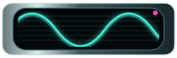 <b>animated fuzzy scope</b></td>
<td width="50%" align="center"> <b>RGB / magenta CRT</b></td>
</tr>
</table>

This family is absolutely staying.

The important visual vocabulary:

- dark curved glass;
- scanline texture;
- phosphor bloom;
- small RGB misregistration;
- not-quite-perfect trace;
- movement that feels electrical and twitchy rather than smooth.

Source lineage: [RABBIT CHAMBER 07](./RABBIT-CHAMBER-07.md) · [RABBIT CHAMBER 08](./RABBIT-CHAMBER-08.md)

---

# 🎚️ 03 // MICRO-METERS

<table>
<tr>
<td align="center"></td>
<td align="center">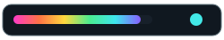</td>
<td align="center">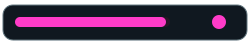</td>
</tr>
</table>

Tiny meters are one of the most useful discoveries because they provide animation and color **without surrendering the surrounding data to an image**.

They belong in:

- build tables;
- feature matrices;
- sound routing;
- load/activity cells;
- status summaries;
- screenshot metadata;
- release information.

Source lineage: [TABLE MUTATIONS 02](./TABLE-MUTATIONS-02.md)

---

# 🫧 04 // GLASS THAT ACTUALLY READS AS GLASS

### Host display / negative-space glass

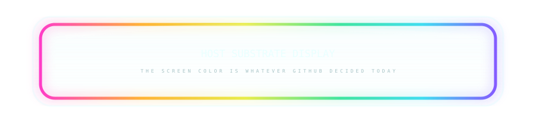

The page itself becomes the screen substrate. The SVG draws only the surrounding optical object.

### Convex optical glass


The material body here is one of the strongest glass genes:

- opposed surface contours;
- asymmetric highlights;
- dark transmitted center;
- cyan ghost reflection;
- visible thickness.

### Dichroic coated slab

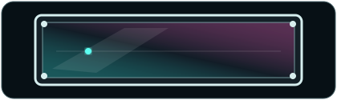

Coating drift + one-way specular sweep + front/rear plane separation.

Source lineage: [RABBIT CHAMBER 12](./RABBIT-CHAMBER-12.md) · [MATERIALS LAB](./MATERIALS-LAB.md)

> **Glass rule:** a transparent shape alone is plastic. Glass needs boundaries, reflected light, transmitted light, and ideally a refracted event.

---

# 🔩 05 // DISASSEMBLED DEVICE / HARDWARE AROUND MARKDOWN

The disassembled-device family was a major turning point: stop drawing one giant fake UI and instead mount **real Markdown between pieces of hardware**.

Especially strong descendants:

<table>
<tr>
<td align="center"> CRT rack</td>
<td align="center"> prismatic spine</td>
<td align="center"> ceramic service panel</td>
</tr>
</table>

Source lineage: [DISASSEMBLED DEVICE](./DISASSEMBLED-DEVICE.md) · [FURNITURE SHOWROOM](./FURNITURE-SHOWROOM.md)

---

# 🧱 06 // TABLES AS MACHINES

## Sidecars beside native content

| organ | component | state | note |
|---|---|---|---|
| 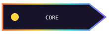 | renderer | READY | color/shape sits beside readable content |
|  | optics | WARM | border becomes module seam |
|  | input | LIVE | padding becomes clearance |
|  | ??? | MUTABLE | alternate row = depth/material cue |

This is one of the most practical discoveries for real project READMEs.

## Crown + native body + foot

| channel | state | payload |
|---|---|---|
| INPUT | LIVE | ordinary Markdown |
| CORE | READY | selectable native text |
| OPTICS | RGB | furniture remains decorative |
| OUTPUT | ??? | probably fine |

Source lineage: [TABLE LAB](./TABLE-LAB.md) · [TABLE MUTATIONS 02](./TABLE-MUTATIONS-02.md) · [RABBIT CHAMBER 06](./RABBIT-CHAMBER-06.md)

---

# 🔌 07 // CONTINUITY CRIMES

<table>
<tr>
<td width="50%">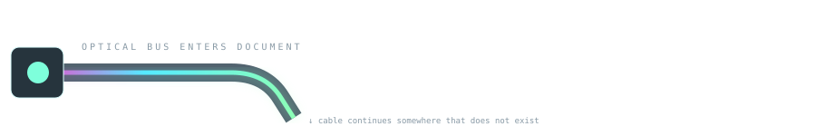</td>
<td width="50%">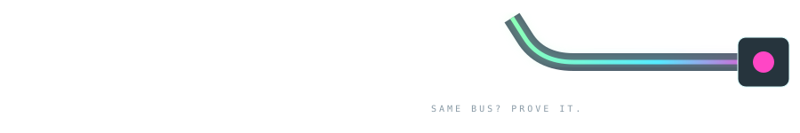</td>
</tr>
</table>

A cable can enter, vanish for several screens of native Markdown, then reappear later.

The missing span is supplied by the reader's brain.

This was one of the first genuinely **non-Euclidean Markdown** tricks rather than merely decorative SVG.

Source: [CONTINUITY CRIMES](./CONTINUITY-CRIMES.md)

---

# ⚡ 08 // ANIMATION = CAUSALITY

### Phase-timed photon / hydraulic spinal cord

<table>
<tr><td></td><td><b>01 / intake</b></td><td>event enters</td></tr>
<tr><td></td><td><b>02 / optics</b></td><td>carrier crosses bulkhead</td></tr>
<tr><td></td><td><b>03 / chroma</b></td><td>signal mutates</td></tr>
<tr><td></td><td><b>04 / thermal</b></td><td>amber event</td></tr>
<tr><td></td><td><b>05 / output</b></td><td>event returns to reality</td></tr>
</table>

Five separate SVG files. Five separate table cells. One apparent traveling event.

> **Spatial discontinuity + temporal continuity.**

Source: [RABBIT CHAMBER 10](./RABBIT-CHAMBER-10.md)

---

# 🧪 09 // MATERIAL ODDITIES WORTH KEEPING AROUND

<table>
<tr>
<td align="center"> <b>aquarium / impossible blue</b></td>
<td align="center"> <b>resin specimen</b></td>
</tr>
<tr>
<td align="center"> <b>inflatable / bubble console</b></td>
<td align="center">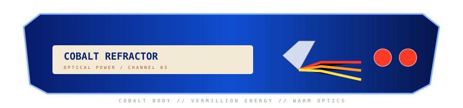 <b>cobalt refractor</b></td>
</tr>
</table>

These are good reminders that the library should not collapse into only one glass/metal aesthetic.

Source: [FURNITURE SHOWROOM](./FURNITURE-SHOWROOM.md) · [MATERIALS LAB](./MATERIALS-LAB.md)

---

# 💿 10 // CARTRIDGES / RELEASES / SMALL PHYSICAL OBJECTS

<table>
<tr>
<td width="50%" align="center">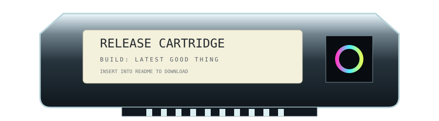 <b>release cartridge</b></td>
<td width="50%" align="center">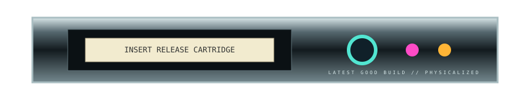 <b>release dock</b></td>
</tr>
</table>

Downloads, presets, samples, board packs, themes, and releases all benefit from looking like **removable physical media**.

---

# 🥝 11 // KEYWI DIRECTION // CURRENT PROJECT-SPECIFIC FAVORITES

The Keywi README lineage should borrow from the whole library, not merely the newest chamber.

Especially favored for Keywi:

- transparent mascot PNGs as page intrusions;
- fuzzy CRT diagnostics;
- micro-meters;
- sidecars in tables;
- screenshot sockets;
- sinebow signal buses;
- amber/UV instrumentation;
- thick clear/dichroic glass;
- refractive RGB edges;
- physical keycap-like navigation;
- dark machinery pierced by concentrated chroma.

Current working chamber:

### [04 // KEYWI CHROMA OVERDRIVE →](./04-KEYWI-MASCOT-LAB-CHROMA-OVERDRIVE.md)

Earlier Keywi experiments:

[01](./KEYWI-MASCOT-LAB-01.md) · [02](./KEYWI-MASCOT-LAB-02.md) · [03](./KEYWI-MASCOT-LAB-03.md)

---

# 🐇 12 // SOURCE CHAMBERS WORTH REVISITING

| rabbit hole | why it matters |
|---|---|
| [NON-EUCLIDEAN GEOCITIES](./NON-EUCLIDEAN-GEOCITIES.md) | GitHub itself becomes part of the rendering |
| [SHENANIGANS](./SHENANIGANS.md) | image-map-era instincts / fake OS / layout crimes |
| [MATERIALS LAB](./MATERIALS-LAB.md) | glass, metals, resin, velvet, CRT, aero |
| [FURNITURE SHOWROOM](./FURNITURE-SHOWROOM.md) | first reusable physical page components |
| [CHROMATIC FURNITURE](./CHROMATIC-FURNITURE.md) | alternative palette language |
| [CONTINUITY CRIMES](./CONTINUITY-CRIMES.md) | separated objects pretending to be one system |
| [TABLE LAB](./TABLE-LAB.md) | table grid as mounting hardware |
| [RABBIT 07](./RABBIT-CHAMBER-07.md) | animated SVG survived GitHub |
| [RABBIT 08](./RABBIT-CHAMBER-08.md) | animation became causality |
| [RABBIT 10](./RABBIT-CHAMBER-10.md) | phase-offset serial events |
| [RABBIT 12](./RABBIT-CHAMBER-12.md) | optical causality + improved glass |

---

# 💖 13 // CURATION RULE

A thing gets promoted here when at least one of these is true:

1. **we keep coming back to it;**
2. it solves a real README/layout problem;
3. it creates a convincing material or physical illusion;
4. it survives GitHub rendering particularly well;
5. it opens a reusable design grammar;
6. it is simply too delightful to lose in the laboratory debris.

When a new rabbit mutates into something especially good, add it here instead of trusting us to remember which chamber contained the shiny thing.

 <b>MASTER CABINET // FAVORITES SURVIVE SELECTION 🌈🔩🐇</b>

