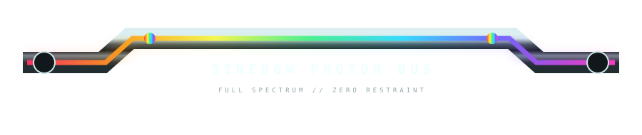
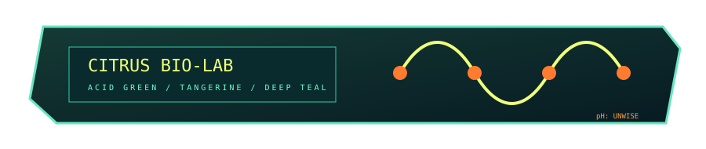
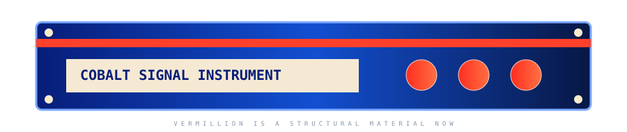
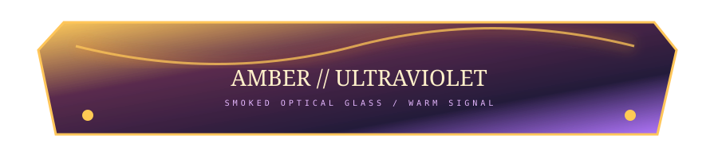
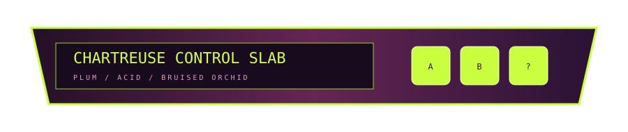

# 🌈🔧 CHROMATIC FURNITURE / FORBIDDEN PALETTE CABINET

> The previous furniture had a favorite sweater. We have confiscated it.

The blue–purple–pink family is lovely, but a component library gets much stranger when **color itself carries material and functional identity**. This shelf tests full-spectrum sinebow against compact palettes from less-visited corners of the wheel.

---

## 01 // FULL SPECTRUM — SINEBOW PHOTON BUS

Not rainbow *decoration*: rainbow as **signal path**. Keep the chassis neutral and let a narrow spectral bus behave like trapped light. This should get especially delicious inside clear acrylic / glass furniture where the spectrum can appear to refract, split, and leak into edge highlights.

**Palette:** vermillion → orange → sulfur yellow → spring green → cyan → indigo → magenta → loop.

---

## 02 // CITRUS BIO-LAB

Deep petrol teal + acid/chartreuse + tangerine. Less vaporwave, more **forbidden laboratory instrument recovered from a 1997 children's science museum**.

This one could be excellent for status/health/instrumentation furniture because the lime reads electrically alive without defaulting to cyan.

---

## 03 // VERMILLION × COBALT

Hard complementary-ish tension: saturated cobalt, vermillion red-orange, and warm ivory labels. Feels simultaneously industrial, Bauhaus-ish, old scientific equipment, and weirdly toyetic.

Important experiment: **large saturated structural color**, rather than confining color to LEDs and trim.

---

## 04 // AMBER × ULTRAVIOLET

Smoked plum optical glass lit with amber. This is the warm nocturnal cousin of our cyan/pink glass: sodium-vapor laboratory, vintage amber displays, ultraviolet edge contamination.

This palette wants brass, smoke glass, dark walnut, oxidized metal, and honey-colored resin nearby. 👀

---

## 05 // CORAL × GLACIAL CYAN

Not pink-and-blue: **hot coral-red against pale mineral aqua**, with deep ocean ink as the neutral. Feels like marine scientific equipment or a chunk of ice containing an emergency beacon.

This could work beautifully for Ocean Dolphin Aero without every watery object becoming blue-on-blue.

---

## 06 // CHARTREUSE × PLUM

Bruised plum + chartreuse + dusty orchid. A little poisonous, a little botanical, a little 1970s appliance from a timeline with better drugs.

The chartreuse is intentionally allowed to become the *physical control material*, not merely a light.

---

# 🧪 PALETTE THEORY FOR ILLEGAL FURNITURE

A few rules worth breaking deliberately:

| strategy | chassis/body | signal/light | label/quiet tone | resulting fiction |
|---|---|---|---|---|
| **sinebow** | graphite / clear | whole spectrum | cool white | optical computer |
| **citrus lab** | petrol teal | acid lime | orange | bio-instrument |
| **cobalt vermillion** | cobalt | vermillion | warm ivory | precision machine / toy |
| **amber UV** | smoke plum | amber | pale violet | nocturnal optical device |
| **coral ice** | translucent aqua | coral | navy | marine instrument |
| **chartreuse plum** | plum | chartreuse | orchid | poisonous control panel |

The useful shift is: **a palette is not branding; it is evidence about what the imaginary object is made of and what kind of energy moves through it.**

So the same README could legitimately contain multiple palettes if the objects have different functions. Optical buses get sinebow. Power hardware gets vermillion. Fluid systems get aqua/coral. Service labels get ivory. Strange biological modules get chartreuse. Suddenly color becomes part of the machine's fake engineering grammar.

---

## NEXT: COLOR CAN TRAVEL TOO 😈

The continuity-crime idea gets nastier if *color* is the thing crossing missing space:

- white light enters an optical section; a sinebow spectrum emerges several sections later,
- a cyan pipe disappears and returns orange, implying something happened behind the Markdown,
- tiny LEDs establish a palette that slowly migrates around the color wheel as the README descends,
- a transparent cable carries several independently colored strands which split into different section headers,
- two boring metal objects become visually connected solely because the same impossible spectral reflection appears on both,
- full-spectrum RGB is reserved for **energy**, while smaller palettes identify subsystems/materials.

And yes: next I want to combine this with the negative-space/device trick so the document gradually develops a **chromatic nervous system** that only exists in disconnected glimpses. 🐇

[Continuity Crimes](./CONTINUITY-CRIMES.md) · [Furniture Showroom 01](./FURNITURE-SHOWROOM.md) · [Materials Lab](./MATERIALS-LAB.md)
