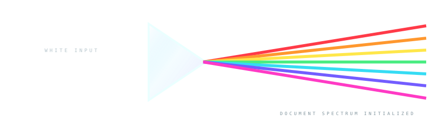
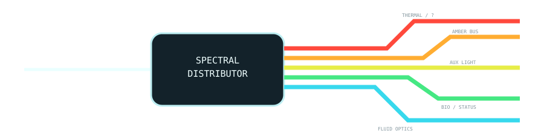
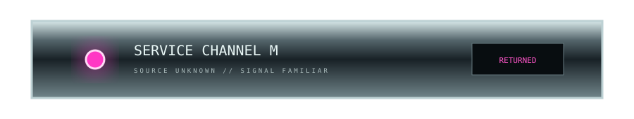
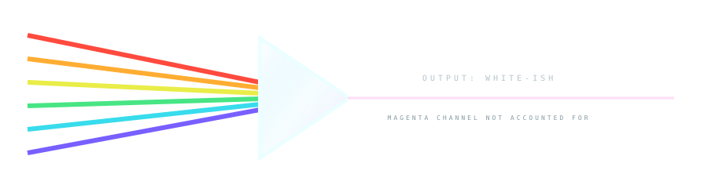

# 🌈🧠 CHROMATIC NERVOUS SYSTEM

> **One machine. Several screens of scroll depth. No connecting geometry.**

This experiment treats the README itself as the missing substrate of an optical computer. Color does not decorate sections. **Color travels through them.**

---

## 00 // INCIDENT LIGHT



A white signal enters from outside the document and is immediately disassembled.

There is no reason to believe the seven resulting channels will remain together.

---

## 01 // ORDINARY DOCUMENTATION OCCURS INSIDE THE BEAM PATH

The machine now politely disappears so we can have a README.

```bash
npm install
npm run dev
# photons continue somewhere behind this code block, allegedly
```

| subsystem | condition | notes |
|---|---:|---|
| renderer | READY | GitHub |
| spectrum | SPLIT | 7 channels observed |
| geometry | UNSUPERVISED | do not encourage |
| cable management | NONE | human cortex assigned |

### A screenshot could live here

This space is intentionally native. In a real project this might be architecture notes, screenshots, usage examples, installation instructions, API docs, whatever the README actually needs to communicate.

The important part is that the reader remembers the light even when it is absent.

---

## 02 // DISTRIBUTION NODE FOUND MUCH LATER



Interesting.

Only five channels are visibly routed onward.

Nobody signed off on this.

---

## 03 // ORANGE WAS APPARENTLY POWERING THIS THE WHOLE TIME

More native content first, because physical distance is doing useful work here.

> A component does not need to touch its source to feel connected to it. Repeated color + material language + remembered direction is enough to imply a hidden route.


The orange/amber channel arrives from nowhere and terminates in smoked violet glass. The glass now feels *energized* rather than merely amber-colored.

### service note

`CHANNEL O` has been removed from the visible bus. Its energy appears to remain locally trapped in the optical cavity.

---

## 04 // CYAN HAS BECOME A FLUID PROBLEM

Imagine another several paragraphs here. Perhaps this is an image gallery. Perhaps it is the configuration section. Perhaps a bird has been added for no documented reason.

<details>
<summary>▸ open completely unrelated native details widget</summary>

The cyan line is still not here.

That is important.

</details>


It comes back as plumbing.

The channel entered as light. It is now visually dissolved into a transparent aqua reservoir. Whether this represents data, coolant, photons, or documentation juice is intentionally unresolved.

---

## 05 // MAGENTA IS MISSING

We have not seen magenta since the input prism.

That sentence is itself part of the visual apparatus. Once the README explicitly notices a missing channel, every pink object below becomes suspicious.

### More boring useful text

This is where a project might explain keyboard layouts, Android behavior, CI, configuration, architecture, known limitations, or release procedure.

Nothing pink here.

Nothing pink here either.

Still nothing.

---

## 06 // OH.



One LED.

That's all it takes.

The LED does not need a wire. The reader has been carrying the missing magenta channel in working memory for several screens and will cheerfully install the wire themselves.

> **Delayed color payoff turns a decorative accent into plot.**

---

## 07 // ATTEMPTED RECOMBINATION

At the bottom of the device, the surviving channels converge.



The output is nearly white.

Nearly.

Magenta is still powering the service panel somewhere above us, so the reconstructed beam has a faint cyan/green bias and a tiny pink contamination line that absolutely should not be there.

This means the README has acquired **state** purely through visual storytelling.

---

# 🧠 WHAT JUST HAPPENED

No SVG on this page knows another SVG exists.

There is no continuous background image. No canvas. No JavaScript. No absolute positioning across sections. No real optical path.

Yet the page can imply:

- an input outside the README,
- a prism splitting that input,
- hidden routing behind Markdown,
- subsystem-specific color consumption,
- a channel changing medium from light to fluid,
- a missing signal,
- delayed reappearance,
- incomplete recombination,
- and an output whose state depends on an event several screens earlier.

The **scroll axis has become a spatial axis** and color has become memory.

---

## 🐇 NEXT CRIME: EXPLODED DOCUMENT

The next mutation can combine this with physical furniture.

Instead of a single implied chassis, the README becomes an exploded technical diagram stretched vertically through scroll space:

**front glass**

↓ native Markdown gap

**display layer**

↓ architecture diagram

**optical bus**

↓ installation docs

**logic board**

↓ screenshots

**reservoir / weird biological thing**

↓ changelog

**rear I/O panel**

Each layer gets different materials and palettes, but recurring screws, optical fibers and alignment marks imply that the whole page could theoretically collapse into one impossible physical object.

> **The page is the exploded view. Scrolling is disassembly.**

[Palette Mutations](./PALETTE-MUTATIONS.md) · [Chromatic Furniture](./CHROMATIC-FURNITURE.md) · [Continuity Crimes](./CONTINUITY-CRIMES.md) · [Furniture Showroom](./FURNITURE-SHOWROOM.md)
