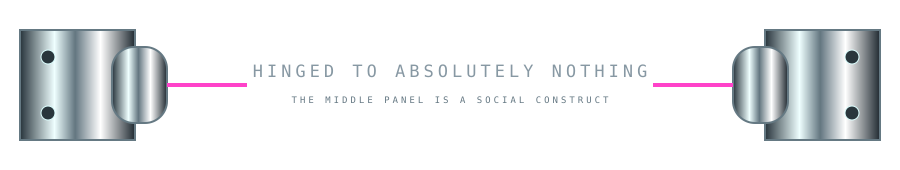
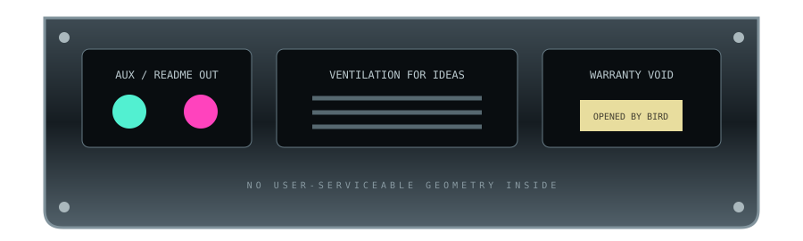

# 🐇🕳️ CONTINUITY CRIMES

> **Furniture Showroom 02:** components that only become objects because the reader remembers something from earlier.

The first showroom contained things. This one contains **relationships between things separated by Markdown**.

---

## `01 // AN OPTICAL CABLE ENTERS THE DOCUMENT`


Nothing follows it.

At least, nothing *visually* follows it.

### Normal useful documentation happens here

A README can contain paragraphs, screenshots, install instructions, examples, tables, whatever it actually needs. The cable has vanished behind that content—or behind the page—or into another dimension. GitHub does not care.

| useful thing | status |
|---|---:|
| native Markdown | alive |
| selectable text | yes |
| layout gimmick | currently missing |
| reader suspicion | increasing |

### More normal content

```bash
# this command has absolutely nothing to do with the glowing cable
./ignite.sh
```

The gap is the component.

### Several conceptual meters later…


Did that cable travel behind everything above?

There is **no technical relationship whatsoever** between those SVGs. Their matching material language manufactures continuity retrospectively.

---

## `02 // RELEASES AS PHYSICAL MEDIA`

<a href="../../releases"></a>

The whole cartridge is a hyperlink. This is useful furniture: instead of a DOWNLOAD button, the README can present the latest release as a **removable physical object**.

Future variants: floppy, MiniDisc, translucent Game Boy cartridge, lab sample cassette, optical puck, ridiculous proprietary 2003 Sony media format that existed for eleven months.

---

## `03 // A PANEL WITH NO PANEL`



# This heading is apparently mounted on a door now.

There is no door asset.

There are hinges on the page edges, therefore your brain begins looking for the hinged object. Native Markdown sitting between them becomes the most convenient suspect.

> **HINGE THEORY:** hardware can assign physical properties to unrelated DOM content.

This is deliciously reusable. Add handles and suddenly a section is a drawer. Add rack ears and it becomes equipment. Add binder rings and the README becomes a manual page. Add clamps and it becomes a lab specimen.

---

## `04 // LABELS AS SECTION METADATA`


Instead of designing every section heading as a glorious banner, some can be intentionally cheap physical labels. This creates material hierarchy: expensive glass title → machine body → masking-tape-ish lab labels → native text.

### UNKNOWN COMPONENT

This part can contain boring implementation notes. The cheap label makes that boringness feel *diegetic* rather than unfinished.

---

## `05 // THE README HAS AN UNDERSIDE`

Most READMEs end with links, license text, acknowledgements, or nothing.

That is cowardice.

They should end by exposing the **rear I/O panel of the document**.



The scroll has physically passed through the device. We started at its face and eventually reached its back.

---

# 🧠 NEW FURNITURE PRIMITIVES DISCOVERED

**Delayed continuity** — two objects separated by arbitrary content become one remembered object.

**Property injection** — hinges, handles, screws, rack ears, feet, clamps, vents and sockets make native Markdown inherit imaginary physical properties.

**Semantic props** — a release link can be a cartridge; install instructions can be a service hatch; screenshots can be monitors; changelogs can be maintenance logs.

**Material hierarchy** — not everything should be equally spectacular. Cheap labels make expensive glass feel more expensive.

**Scroll depth** — the top and bottom of the README can represent different physical sides/layers of one machine.

**Retrospective geometry** — an object encountered later can change what the reader believes an earlier object was.

---

## next hole ↓

I want to try furniture that crosses **Markdown semantics**, not merely visual space:

1. an actual `<details>` widget presented as a latched service door,
2. a native Markdown table installed between two rack ears,
3. screenshots as swappable LCD modules,
4. linked SVG tabs arranged like a hardware patch bay,
5. a sequence of section furniture that slowly rotates the implied machine from front → interior → rear,
6. paired pipes where one changes color/material after disappearing behind content,
7. deliberately incomplete shadows/reflections whose missing object is the Markdown itself,
8. a giant exploded-view README where each ordinary section is interpreted as a separate floating component.

> **The README is no longer decorated. It is being accused of being hardware.**

[Showroom 01](./FURNITURE-SHOWROOM.md) · [Topology Party](./TOPOLOGY-PARTY.md) · [Disassembled Device](./DISASSEMBLED-DEVICE.md) · [Materials Lab](./MATERIALS-LAB.md)
