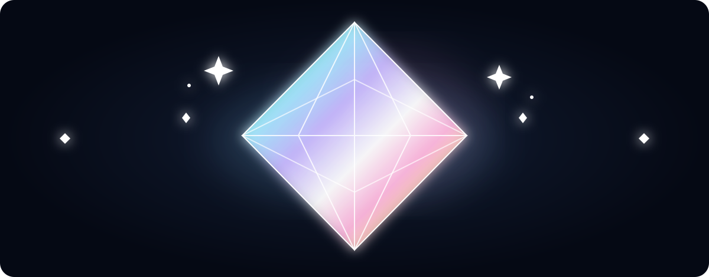
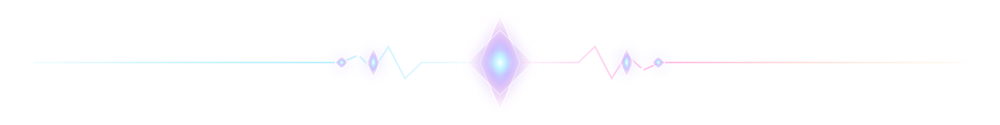
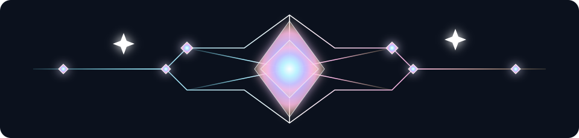

<p align="center"></p>

<div align="center">

# ✧ C R Y S T A L　L A B ✧

**a GitHub-rendered specimen in iceglass, opal light & tiny bad decisions**

`FACETED`　✦　`PRISMATIC`　◇　`TRANSLUCENT`  
⟡　`BIRD-ENGINEERED`　⟡

</div>

<p align="center"></p>

> [!NOTE]
> ### ✦ DESIGN SIGNAL　◇ ⟡ ✧
> Keep the geometry sharp and the palette soft: **white glass · glacial cyan · periwinkle · blush · tiny gold flare.**  
> The glow belongs on the edges, intersections and little impossible points of light.

<table>
<tr>
<td align="center"><b>◇ ICE</b><br><sub>white glass</sub></td>
<td align="center"><b>⟡ CYAN</b><br><sub>cold light</sub></td>
<td align="center"><b>✧ VIOLET</b><br><sub>soft prism</sub></td>
</tr>
<tr>
<td align="center"><b>◇ PEACH</b><br><sub>warm facet</sub></td>
<td align="center"><b>✦ PINK</b><br><sub>spectral flash</sub></td>
<td align="center"><b>⋆ GOLD</b><br><sub>edge spark</sub></td>
</tr>
</table>

<p align="center"></p>

## ✧ CRYSTAL TELEMETRY　◇⟡✧

| CHANNEL | TREATMENT | INTENSITY |
|:--|:--|:--:|
| ❄️ **ice** | white → cyan | ◇◇◇◇◇◇◇◇·· |
| 🪻 **violet** | periwinkle → lavender | ⟡⟡⟡⟡⟡····· |
| 🌸 **spectral** | blush · peach · gold | ✦✦✦······· |
| 💎 **glass** | highlight · refraction | ◇⟡◇⟡◇⟡◇⟡◇⟡ |
| ✧ **glint** | impossible little lights | ✧··✧···✧·· |

<p align="center"></p>

<table>
<tr>
<td align="center"><h3>◇ TRANSPARENT</h3><sub>layered refraction<br>partial opacity</sub></td>
<td align="center"><h3>⟡ GEOMETRIC</h3><sub>clean facets<br>crisp silhouette</sub></td>
</tr>
<tr>
<td align="center"><h3>✦ SHINY</h3><sub>spectral highlights<br>tasteful bloom</sub></td>
<td align="center"><h3>✧ FLEXIBLE</h3><sub>light or dark<br>tiny or huge</sub></td>
</tr>
</table>

<p align="center"></p>

<details>
<summary><b>◇ OPEN REFRACTION CHAMBER ◇</b></summary>

<div align="center">

### ✧ INTERNAL OPTICS ✧

```text
            ✧
       ◇────⟡────◇
        ╲   │   ╱
     ✦───◇──✧──◇───✦
        ╱   │   ╲
       ◇────⟡────◇
            ✧
```

**WHITE LIGHT IN → WEIRD KEYBOARD ENERGY OUT**

`kaomoji` ✧ `unicode` ◇ `tools`  
⟡ `chroma` ✦ `mischief`

</div>
</details>

> [!IMPORTANT]
> **◇ GEOMETRY FIRST // GLOW SECOND.**  
> If every luminous effect vanished, the page should still read as a cut gem.

<div align="center">

### ✧──◇──⟡◇⟡──✦──⟡◇⟡──◇──✧

# KEYWI

*cut weirdly · type beautifully*

<sub>GitHub Markdown, now with approximately 340% more refractive index.</sub>

✧　⋆　◇　⟡　✦　⟡　◇　⋆　✧

</div>
