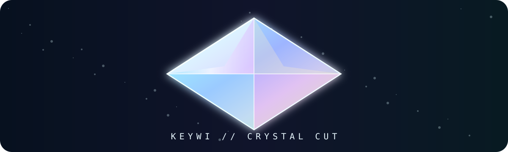
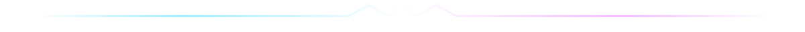

<p align="center">
  
</p>

<div align="center">

# ⟡◇⟡ KEYWI // CRYSTAL LAB ⟡◇⟡

**a GitHub-rendered specimen in iceglass, opal light & tiny bad decisions**

```text
                 ✧
             ⋆   │   ⋆
          ⟡──────◇──────⟡
        ✦╲       │       ╱✦
      ◇───╲──────◇──────╱───◇
        ✧  ╲    ╱ ╲    ╱  ✧
            ◇──◇   ◇──◇
              ╲│   │╱
               ⟡   ⟡
                ╲ ╱
                 ◇
                 │
                 ✦
```

FACETED　·　PRISMATIC　·　TRANSLUCENT　·　BIRD-ENGINEERED

</div>

<p align="center"></p>

> [!NOTE]
> **DESIGN SIGNAL //** Keep the geometry sharp and the palette soft: mostly white glass, glacial cyan and periwinkle, with tiny spectral flashes of peach, pink and gold.

<table>
<tr>
<td width="33%" align="center"><h3>⟡◇⟡ CUT ⟡◇⟡</h3><b>octahedral / gem-cut</b><br><br>Crisp enough to survive<br>a 48 px launcher icon.<br><br>◇╱⟡╲◇</td>
<td width="33%" align="center"><h3>✦⋆✧ LIGHT ✧⋆✦</h3><b>opalescent / refractive</b><br><br>Color lives <i>inside</i> the glass,<br>not as a loud flat fill.<br><br>✧ ── ✦ ── ✧</td>
<td width="33%" align="center"><h3>◇⟡◇ SURFACE ◇⟡◇</h3><b>clear / adaptive</b><br><br>Designed to float cleanly over<br>light, dark & chromatic UI.<br><br>⟡╲◇╱⟡</td>
</tr>
</table>

<div align="center">

```text
✧───────────────⟡◇⟡───────────────✧
                 │
           ✦─────◇─────✦
                 │
✧───────────────⟡◇⟡───────────────✧
```

</div>

## ✧ Crystal telemetry

| channel | treatment | intensity |
|:--|:--|:--:|
| ❄️ **ice** | white → powder blue → cyan | ◇◇◇◇◇◇◇◇·· |
| 🪻 **violet** | periwinkle → soft lavender | ⟡⟡⟡⟡⟡····· |
| 🌸 **spectral** | blush / peach / tiny gold flare | ✦✦✦······· |
| 💎 **glass** | transparency, highlight, refraction | ◇⟡◇⟡◇⟡◇⟡◇⟡ |
| 💥 **neon** | reserved for microscopic edge sparks | ✧········· |

> [!TIP]
> The fun bit is restraint. The earlier Scratch page proved GitHub Markdown can become a Lisa-Frank reactor. This one asks what happens when the same bag of tricks gets art-directed — including making the typography do some actual structural work.

<details>
<summary><b>⟡ crack open the crystal ⟡</b></summary>

<br>

<div align="center">

### 𝙸𝙽𝚃𝙴𝚁𝙽𝙰𝙻　𝚁𝙴𝙵𝚁𝙰𝙲𝚃𝙸𝙾𝙽

```text
                    ✧
               ⋆    │    ⋆
          ✦─────────◇─────────✦
             ╲      │      ╱
        ⟡─────◇─────⟡─────◇─────⟡
          ╲    ╲   ╱ ╲   ╱    ╱
           ◇────◇─◇   ◇─◇────◇
             ╲   ╲│   │╱   ╱
              ✧   ⟡───⟡   ✧
                    ╲ ╱
                     ◇
                     │
                     ✦
```

**white light goes in → weird keyboard energy comes out**

⟡ kaomoji　✧ unicode　◇ tools　⋆ chroma　✦ mischief

</div>
</details>

<p align="center"></p>

## ⟡ Gem-cut interface language

<table>
<tr><td><b>◇ Primary planes ◇</b><br>large, quiet, almost-white facets</td><td><b>⟡ Edge planes ⟡</b><br>icy blue / violet contrast for silhouette</td></tr>
<tr><td><b>✦ Refraction ✦</b><br>small rainbow incursions rather than full-spectrum fill</td><td><b>✧ Motion ✧</b><br>slow glint, parallax or spectral sweep — never casino sparkle</td></tr>
</table>

<div align="center">

```text
      ✧       ⋆       ✧
       ╲      │      ╱
        ⟡─────◇─────⟡
         ╲    │    ╱
          ◇───✦───◇
         ╱    │    ╲
        ⟡─────◇─────⟡
       ╱      │      ╲
      ✧       ⋆       ✧
```

</div>

> [!IMPORTANT]
> **Icon rule:** it still has to read as a cut gem when the refraction disappears. Geometry first; chroma second.

<div align="center">

### ✧──⟡◇⟡──✦──⟡◇⟡──✧

**KEYWI**

*cut weirdly · type beautifully*

<sub>GitHub Markdown, but somebody finally took the energy drink away from it.</sub>

⟡　◇　⟡　✦　⋆　✧　⋆　✦　⟡　◇　⟡

</div>
