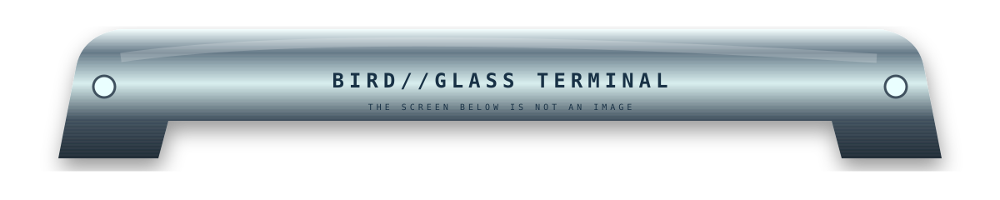
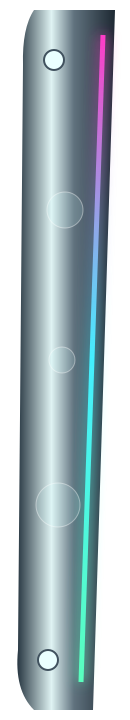
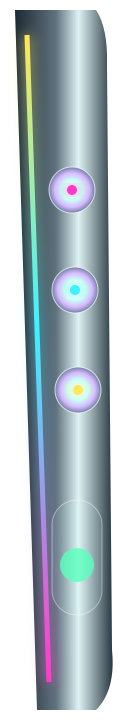
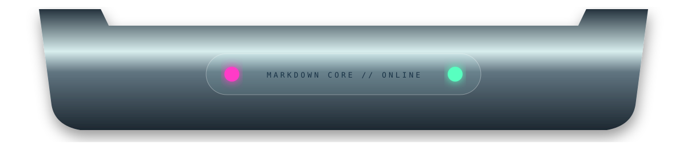

<p align="center"></p>

<table><tr><td width="11%" valign="top"></td><td width="78%" valign="top">

# `BIRD//GLASS TERMINAL`

### `CHANNEL 01 — NATIVE MARKDOWN CORE`

This entire center region is **ordinary GitHub Markdown**. The metal/glass object around it is physically disassembled into separate SVG files. Your brain gets the unenviable job of bolting it back together. 🩷

> **STATUS:** `REALITY OPTIONAL`  
> **RENDERER:** GitHub  
> **SUBSTRATE:** whatever theme you're using  
> **CONTAINMENT:** frankly poor

The important experiment is continuity. Neither side rail knows how tall this content is. The top and bottom chassis do not know what happened between them. Yet repeated material cues—machined alloy, RGB edge-light, opal controls—may convince the eye that they belong to **one device surrounding live document content**.

---

## 🫧 Screen contents remain alive

- [x] selectable text
- [x] normal links
- [x] native headings
- [x] tables
- [x] code fences
- [x] `<details>` disclosure widgets
- [x] images and badges if desired
- [x] screen can grow without rerendering a giant SVG

<details>
<summary><b>OPEN GLASS SERVICE HATCH</b></summary>

### Oh no. There's Markdown in here too.

```text
DEVICE............. BIRD//GLASS
OPTICAL BUS........ RGB
GLASS.............. HAUNTED
MARKDOWN CORE...... NOMINAL
GEOMETRY........... NON-EUCLIDEAN
```

The disclosure control itself is supplied by GitHub. The fake hardware merely changes what the control *feels like it belongs to*.

</details>

---

## `CHANNEL 02 — LIVE DATA BAY`

| SENSOR | READING | MATERIAL INTERPRETATION |
|:--|:--:|:--|
| edge light | `98%` | 🌈 trapped |
| glass | `clear-ish` | 🫧 suspicious |
| velvet cavity | `soft` | 💗 absorbs photons |
| CRT | `READY_` | 📺 ancient wisdom |
| markdown | `alive` | ✨ host organism |

### The screen has no rectangular image behind it.

That's the trick. The apparent screen is literally this table cell's ordinary background. Dark mode gives us one display substrate; light mode gives us another. We render **the bezel, not the screen**.

---

## `CHANNEL 03 — HYPERTEXT CONTROLS`

[Materials Lab](./MATERIALS-LAB.md) · [Optical Negative Space](./OPTICAL-NEGATIVE-SPACE.md) · [Non-Euclidean GeoCities](./NON-EUCLIDEAN-GEOCITIES.md) · [Shenanigans](./SHENANIGANS.md)

The next version can replace those textual links with separate acrylic control assets, each wrapped in its own Markdown hyperlink. Then the right-hand opal buttons become conceptual controls while the lower glass tabs become *actual* controls.

---

### `MESSAGE FROM THE MACHINE`

> *I am not one image. I am several lies agreeing on where the edges are.*

</td><td width="11%" valign="top"></td></tr></table>

<p align="center"></p>

<p align="center"><sub>THE BEZEL IS SVG. THE SCREEN IS GITHUB. THE DEVICE EXISTS IN YOUR VISUAL CORTEX.</sub></p>
