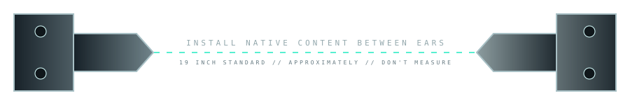
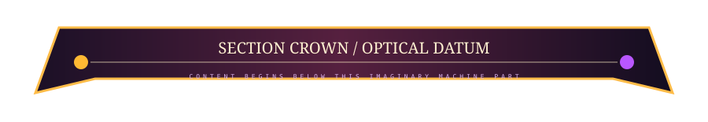
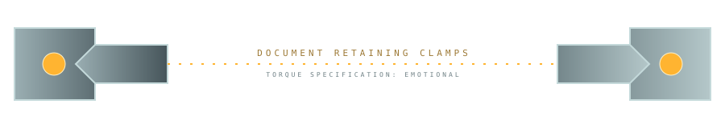

# 😈🔩 ILLEGAL GITHUB FURNITURE — KIT 02

> **Less poster. More architecture.** The SVG does not contain the documentation; it convinces your visual cortex that ordinary Markdown is installed inside hardware.

This generation deliberately breeds **small reusable page-layout primitives** rather than bespoke hero illustrations.

---

## 01 // RACK EARS — native content becomes equipment



### Markdown Channel A

This heading, paragraph, list and table are completely ordinary GitHub content. The rack ears above establish a mechanical context and the content below inherits it.

| input | transform | output |
|---|---|---|
| Markdown | imaginary rack | instrument |
| screenshot | imaginary rack | display module |
| code block | imaginary rack | terminal |

```bash
./this-is-still-selectable.sh --excellent
```


**Pairing primitive:** `rack-ears.svg` + arbitrary native content + `content-feet.svg` creates a device whose center is not an image at all.

---

## 02 // SECTION CROWN — expensive punctuation



### Optical Architecture

The crown does not need to wrap anything. It acts like a materialized `<hr>` plus title datum. Amber → vermillion → violet light makes this section feel like it belongs to a warm optical subsystem without tinting every object purple.

This is good for major README chapters: **Install**, **Features**, **Architecture**, **Gallery**, **Development**, **Releases**.

---

## 03 // GLASS TAB BAR — navigation-shaped furniture


The specimen above is intentionally inert so we can judge the visual component. In production, slice this into four independent linked SVGs or wrap separate `` assets in Markdown/HTML links. Then GitHub thinks it is a row of images while the reader sees **glass hardware controls**.

The thin sinebow rail underneath establishes “data/navigation energy” without making the whole object rainbow.

---

## 04 // STATUS RIBBON — tiny instrumentation


A narrow component can do more layout work than another giant banner. This could sit immediately below a project hero and carry visual interpretations of CI/release/docs/platform state.

For real projects, static versions can be generated by CI, or conventional GitHub badges can live immediately below it as the actual source of truth.

**Palette mutation:** cobalt body + warm status lamps + vermillion data rail. The cobalt family behaves much better here because it has a *job*.

---

## 05 // SIDE CLAMPS — property injection, compact edition



### The text has been detained.

Nothing wraps this paragraph. Nevertheless the clamps imply lateral pressure, so the native Markdown begins to feel like a physical sheet/module held between them.

> You can install these before a screenshot gallery, architecture explanation, warning, changelog excerpt, or basically any content you want to make feel temporarily *mounted*.

The object is mostly negative space. **The missing middle is the useful part.**

---

# 🧰 COMPONENT ROLES

| primitive | job | best density |
|---|---|---|
| **crown** | chapter boundary / major heading | sparse |
| **rack ears + feet** | turn arbitrary native content into a module | medium |
| **tab bank** | project-local navigation | once near top |
| **status ribbon** | compact project instrumentation | once / occasional |
| **clamps** | emphasize or physically claim a section | occasional |
| **spectral bus** | continuity across distant sections | very sparse |
| **label strip** | low-cost metadata / service note | frequent |
| **rear panel** | physical ending | once at bottom |

The key is **rhythm**. A page made entirely of spectacular furniture becomes a catalog. A page where 70–80% remains clean Markdown and furniture appears at structural moments starts feeling like an interface.

---

# 🧬 BREEDING DIRECTIONS

The next useful families should include:

- **screenshot sockets** — top/bottom/side assets that make a normal screenshot look physically installed without baking it into an SVG;
- **code-block terminal bezels** — two-piece framing around native fenced code;
- **warning hardware** — not a giant alert image, but little amber/vermillion physical brackets around a Markdown blockquote;
- **gallery rails** — tiny repeated mounts that let GitHub tables become specimen trays;
- **connector tails** — components ending at an edge so a later section can imply continuation;
- **project identity plates** — replace generic badges with tiny engraved / resin / enamel identity furniture;
- **footer feet + rear I/O variants** — several ways to physically terminate a document;
- **dark/light adaptive clear materials** — maximize transparent substrate so GitHub supplies more of the environment;
- **micro furniture** — screws, numbered tabs, calibration ticks, cable labels, status lamps, inspection stickers;
- **vertical furniture** — narrow left/right objects that exploit tables as layout without swallowing the native center.

And critically: components should come in **material families** while keeping compatible geometry. A project can therefore skin the same layout grammar as aero glass, cobalt/vermillion instrument, amber/UV optics, citrus bio-lab, machined metal, resin, velvet absurdity, etc.

> **The endgame isn't a collection of README pictures. It's a tiny component system for making GitHub pages hallucinate an industrial design language.**

[Chromatic Nervous System](./CHROMATIC-NERVOUS-SYSTEM.md) · [Continuity Crimes](./CONTINUITY-CRIMES.md) · [Furniture Showroom 01](./FURNITURE-SHOWROOM.md) · [Materials Lab](./MATERIALS-LAB.md)
