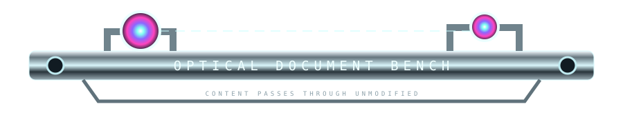
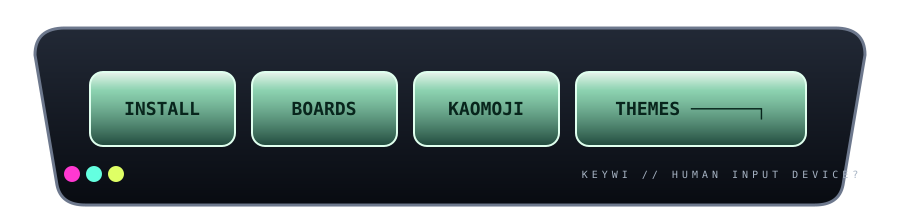
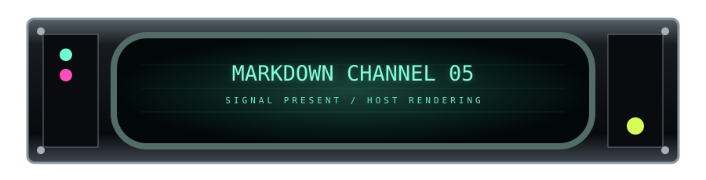
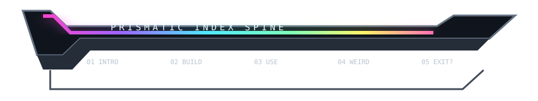
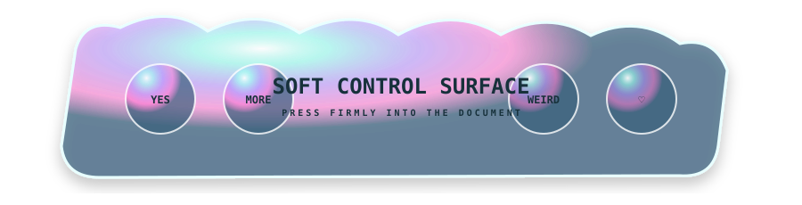

# 🪑✨ ILLEGAL GITHUB FURNITURE — SHOWROOM 01

> GitHub believes this is a Markdown document. Please do not correct it.

The parts below are deliberately **not one visual system**. This is a junkyard / showroom / prop department for stealing pieces from later.

---

## 01 // optical bench



Native Markdown goes here. The SVG only supplies the *instrument surrounding it*. Imagine later versions with a left-side lens, a beam interrupted by the text column, then a detector on the far side several paragraphs later.

### ✦ experiment: continuity through absence

The rail above has hardware that implies a larger apparatus. Nothing requires us to show the apparatus continuously.

---

## 02 // Keywi control bank



This wants to mutate into a full set of giant section-keycaps. Some can be one-key banners; major sections can be **spacebars**. Tiny utility sections could look like F-keys. A screenshot gallery could sit where the alphanumeric block ought to be.

> The README is a keyboard somebody took the letters out of.

---

## 03 // aquarium viewport


Ocean Dolphin Aero gets more interesting if we stop treating water as wallpaper and start treating it as a **place on the other side of a pressure window**. Chrome bolts, acrylic thickness, bubbles, caustics, then boring Markdown beneath it like nothing happened.

---

## 04 // resin specimen slab


Good candidate for changelogs, collections, Feist's photo-organizing personality, or any project where sections can feel like labeled objects embedded in translucent material.

---

## 05 // CRT rack bay



Build status. CI. Debugging. Releases. Logs. Anything that benefits from the fiction that GitHub has become one module in an elderly rack of expensive scientific equipment.

```text
signal: markdown
carrier: github
phosphor: suspiciously healthy
```

---

## 06 // prismatic spine



This one is less a header and more **page anatomy**. I want to explore thin asymmetric side pieces next: a glowing cable entering at one section, vanishing for 800 px of native Markdown, and emerging from an unrelated socket later.

---

## 07 // ceramic service panel


The deeply satisfying appliance/manual aesthetic. Could become INSTALLATION / CONFIG / TROUBLESHOOTING furniture, complete with tiny fake inspection stickers and unreasonable warning pictograms.

---

## 08 // inflatable bubble console



Because not every machine should be made of metal. Some documentation should look as though it would squeak if squeezed.

---

# NEXT MUTATIONS

The most interesting territory now is *between* components:

- dangling optical fibers that apparently pass behind paragraphs
- isolated screws / hinges / latches at page edges
- two SVG halves separated by a real Markdown table, making the table appear installed in hardware
- transparent pipes whose endpoints recur much later in the README
- fake removable media cartridges for downloads/releases
- a screenshot framed as a physical LCD but left as a normal separate image
- section numbers on little removable laboratory labels
- chrome corner protectors with **nothing connecting them**
- warning stripes used only where a conceptual boundary occurs
- a README footer that looks like the underside/back panel of the device

The governing doctrine remains:

> **Render less object than the brain needs, then let negative space hallucinate the rest.**

That is where this gets properly illegal. 🩷
