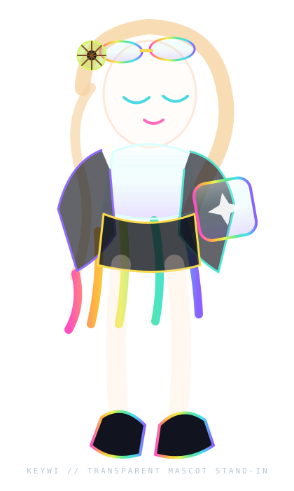

# 🥝💖 KEYWI MASCOT LAB 02 // FAVORITES-FIRST

> **Correction pass:** this page is deliberately built from the pieces that tested best *with Birdie*, not merely the newest experiments.

The visual priorities here are:

- mascot actually present in the composition;
- **glass** with real thickness and reflections;
- **sinebow / RGB light** used as signal, not wallpaper;
- **amber + ultraviolet** as a secondary instrumentation palette;
- **fuzzy CRT** and **micro-meters** as tiny living status hardware;
- **table sidecars** so useful content remains native and readable;
- title/frame hardware from the disassembled-machine experiments;
- Keywi-specific geometry: keycaps, swipe paths, pixel hearts, kiwi/calibration motifs.

---

<table>
<tr>
<td width="36%" valign="top">

This is a transparent **stand-in** proving the page composition. The final Thumb-Key README should swap this for the actual transparent mascot render/cutout, not keep the wireframe.

</td>
<td width="64%" valign="top">

## Keywi

A chromatic, highly-customizable swipe keyboard built around fast input, expressive boards, and a frankly unreasonable amount of personality.

### Why this direction

The mascot should feel like she **belongs to the same machine** as the README furniture. Her goggles become optics. Her translucent keycap becomes acrylic hardware. Her rainbow hair tips become spectral routing. Her black straps/clips become chassis language.

The README should feel like her workbench, not a generic cyberpunk panel with a mascot sticker pasted on.

</td>
</tr>
</table>

---

## 📺 LIVE STATUS // FUZZY CRT + MICRO-METERS

<table>
<tr>
<td></td>
<td>

**Build loop**

The fuzzy CRT is one of the strongest little atoms we bred. Keep it. It reads as actual questionable lab equipment, especially beside ordinary text.

</td>
<td></td>
</tr>
<tr>
<td></td>
<td>

**Theme engine**

Use the RGB/magenta CRT sparingly for especially Keywi-ish state: themes, board preview, animation, or “this feature is doing something weird and pretty.”

</td>
<td></td>
</tr>
</table>

---

## 🌈 FEATURES // SIDE-CAR FURNITURE, NATIVE CONTENT

This is the architecture I want for the eventual real README: small colored hardware lives beside the text instead of replacing it.

|  | feature | what it means |
|---|---|---|
|  | **Boards** | alpha / emoji / unicode / user-defined boards |
|  | **Swipe input** | sides + corners + center, with visual assignment |
|  | **Themes** | chromatic, transparent, dynamic, user-authored |
|  | **Advanced tools** | kaomoji, fancy text, image/GIF actions, utilities |

The colors are **semantic channel identity**. They are not just decoration.

---

## ✨ KEYCAP NAV // PHYSICAL LINKS

<table><tr>
<td></td>
<td></td>
<td></td>
<td></td>
</tr></table>

These should eventually mutate from generic glass tabs into **actual translucent keycaps** matching the mascot's prop.

---

## ⌨️ BOARDS

> **Favorite ingredient brought back:** amber + ultraviolet section hardware.

Normal Markdown stays normal here: board screenshots, board-manager docs, swipe diagrams, etc.

**Native screenshot goes here.**

---

## 🫧 THEMES // GLASS, NOT JUST NEON

The glass line should borrow from the successful tube work: outer wall, inner wall, dark transmitted field, restrained highlight, subtle bloom, and RGB/sinebow refraction only where light actually interacts.

| material | use |
|---|---|
| **clear / aqua glass** | screenshots, nav, benign UI |
| **amber + UV smoked glass** | warnings, advanced settings, experimental features |
| **cobalt + vermillion** | assertive status / destructive or hot actions |
| **sinebow** | photons, data flow, selection state, special events |

---

## 🎛️ ADVANCED SOUND // INSTRUMENT PANEL

| channel | mode | state |
|---|---|---|
| letters | sequential / random |  |
| unicode | per-type |  |
| tools | per-key / per-swipe |  |

This is exactly where the micrometers earn their keep: colorful motion in a tiny cell, while the values and labels remain real text.

---

## 🥝 MASCOT BEHAVIOR IN THE DOCS

The final README should use multiple transparent mascot cutouts as **layout furniture**, not repeated illustrations:

| pose | placement | job |
|---|---|---|
| hero keycap pose | top-left or top-right | identity |
| peeking over glass | section boundary | transition |
| crouched with CRT | build/status | diagnostics |
| pointing / swipe gesture | board docs | directional cue |
| sleeping on keycaps | footer | visual cooldown |
| warning expression | caveats | semantic warning |
| success / sparkle | release section | completion |

The mascot can overlap the *imaginary* chassis visually, but the actual PNG should remain a normal image so GitHub stays sane.

---

## 🧪 BUILD / RELEASE

[**Latest release →**](../../releases/latest)

Put real install/build/release information here. The machine fiction should frame useful content, never replace it.

---

## 🧬 WHAT THIS VERSION IS DELIBERATELY REUSING

This page is not chasing novelty for novelty's sake. It intentionally selects the strongest genes from the experiments so far:

- **disassembled-device framing**;
- **glass title/frame elements**;
- **sinebow photon bus**;
- **amber / ultraviolet hardware**;
- **fuzzy CRT**;
- **micro-meters**;
- **colored sidecars in native tables**;
- **screenshot sockets + lower bezel**;
- **glass host-substrate display**;
- **release cartridge/dock**;
- mascot as a first-class layout element.

The eventual Thumb-Key README should feel **cute + tactile + chromatic + mechanically coherent**.

> Not “generic neon GitHub with anime on top.”
>
> **Keywi's personal input laboratory.** 🥝💖
