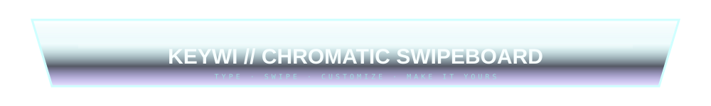
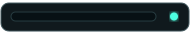
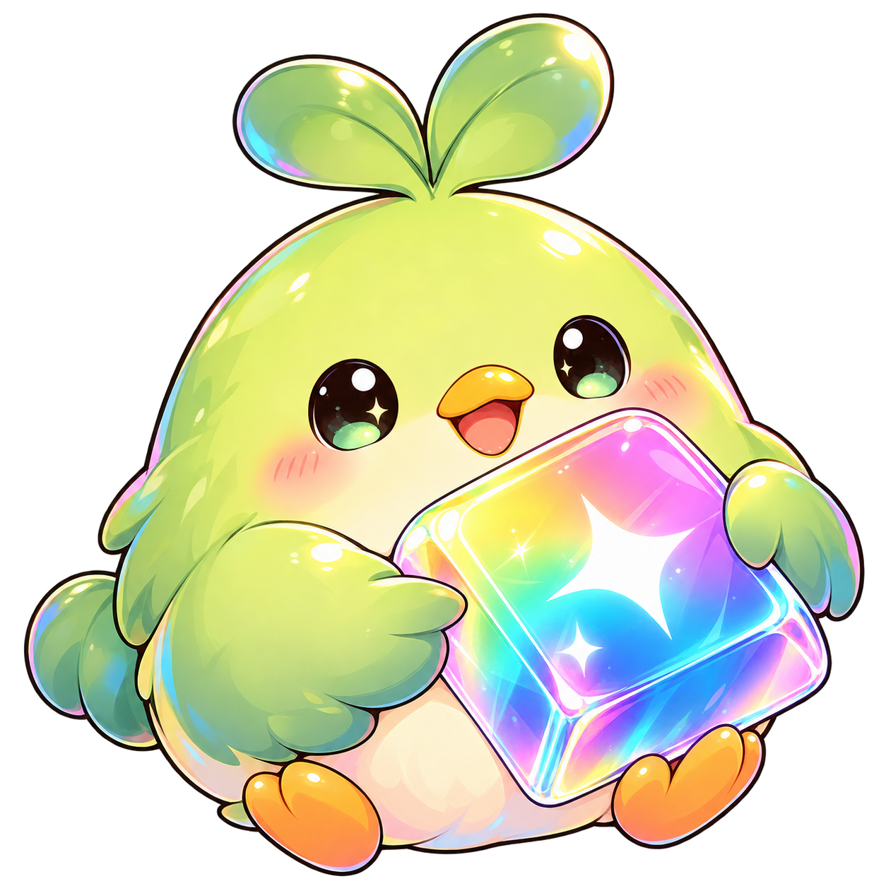
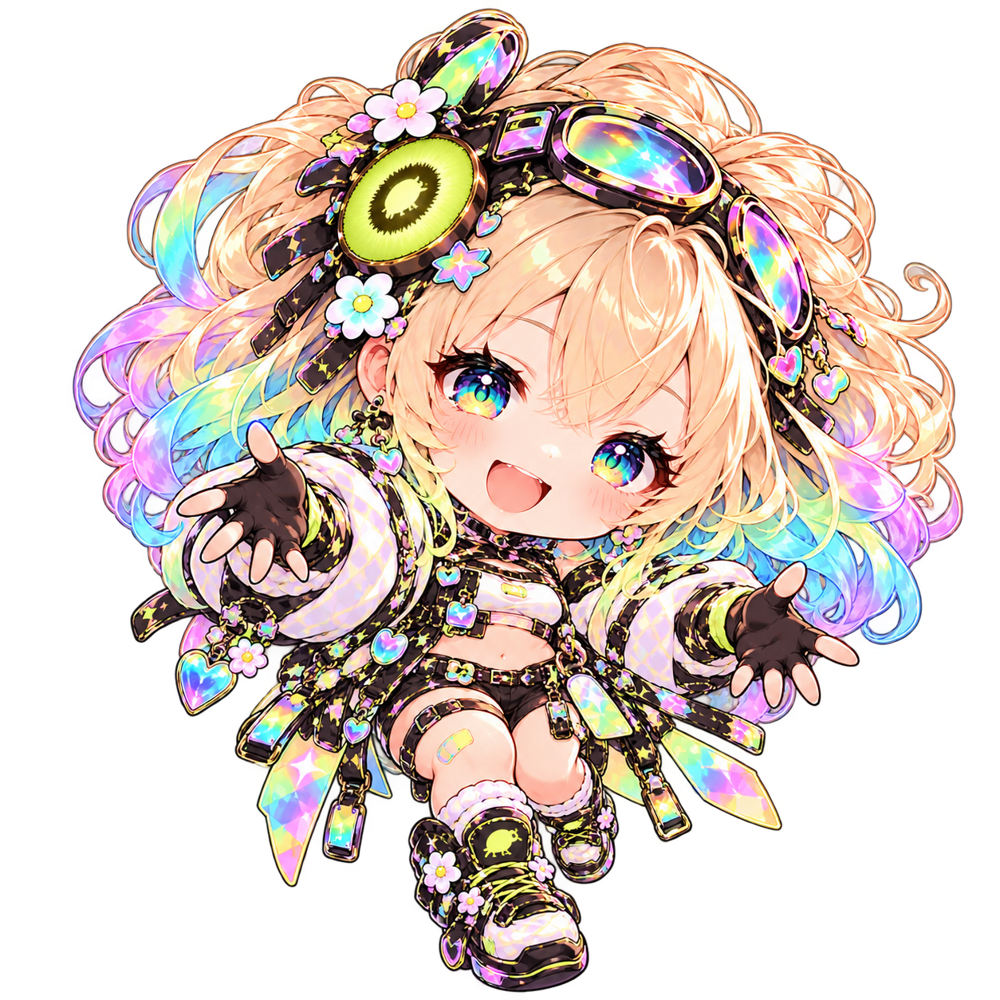
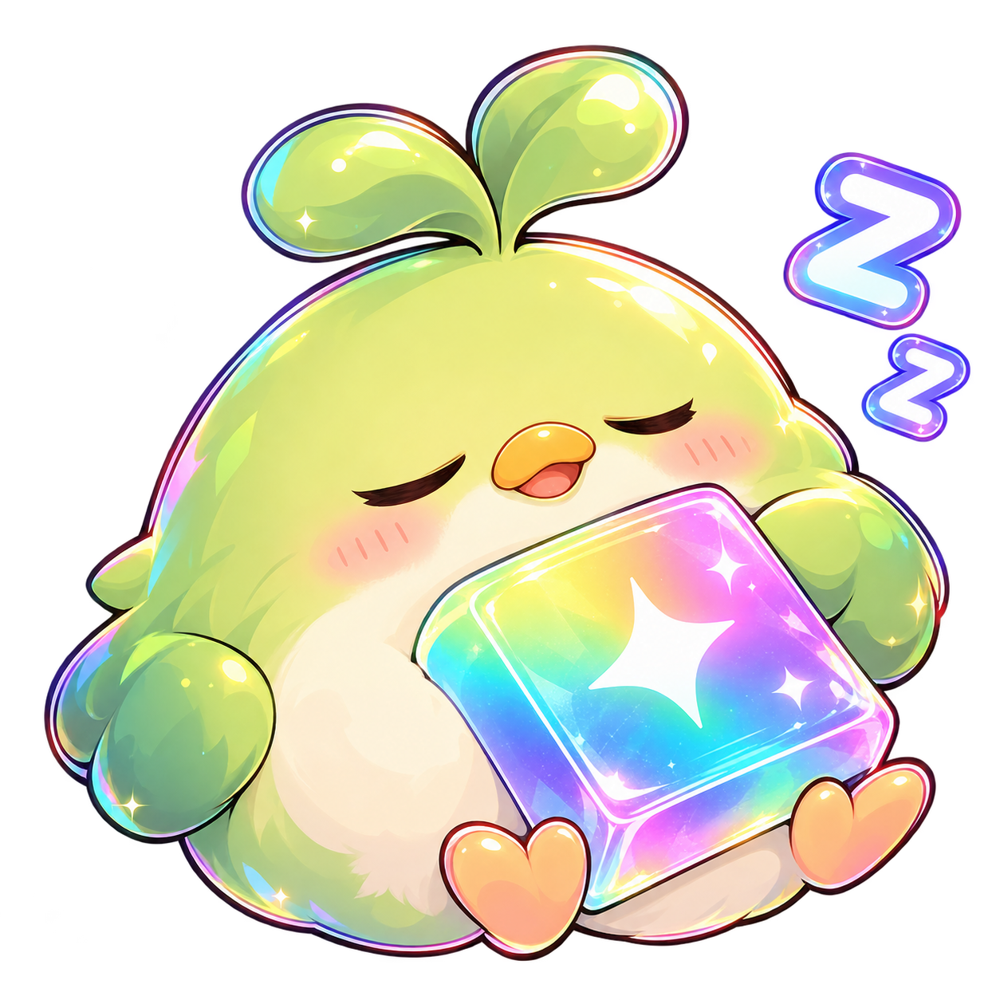
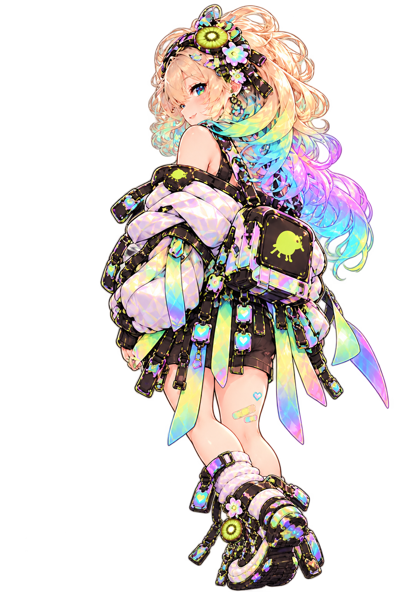
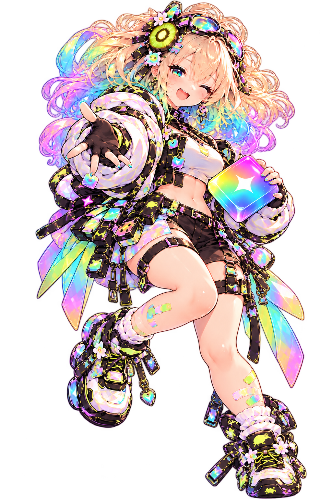

# 🥝🌈💖 KEYWI 03 // THE WAIFU HAS ENTERED THE MACHINE

> **Experimental README chamber.** Real transparent mascot PNG/stickers + the strongest furniture genes + considerably less adult supervision.

  

<table>
<tr>
<td width="38%" valign="bottom" align="center">

</td>
<td width="62%" valign="top">

# KEYWI ✦
### chromatic customizable swipey keyboard

**TYPE // SWIPE // MUTATE // MAKE IT YOURS**

> 🌈 Alpha boards. Emoji boards. Unicode boards. Custom boards. Swipe geometry. Transparent themes. Weird little tools. Your keyboard does not have to look like it came from accounting software.

 

</td>
</tr>
</table>

---

## 📺✨ SYSTEM STATUS // EVERYTHING IS TOO COLORFUL TO FAIL

<table>
<tr>
<td width="24%" align="center"></td>
<td width="52%">

**KEYWI CORE // LIVE**  
Fuzzy phosphor is back because clean LCD rectangles are cowards.

The CRT, meters, sinebow buses, glass and mascot should feel like **one ridiculous physical input laboratory** rather than unrelated decorations.

</td>
<td width="24%" align="center"></td>
</tr>
</table>

　　

---

## 💿🌺 CONTROL DECK // PICK A PORTAL

<table>
<tr>
<td align="center"> <b>BOARDS</b></td>
<td align="center"> <b>THEMES</b></td>
<td align="center"> <b>SOUNDS + TOOLS</b></td>
<td align="center"> <b>RELEASES</b></td>
</tr>
</table>

---

## ⌨️💚 BOARDS // PUT THE GRID IN A CUTE LITTLE MACHINE

<table>
<tr>
<td width="72%" valign="top">

|  | BOARD ORGAN | STATE | WHAT IT DOES |
|---|---|---|---|
|  | **ALPHA** | LIVE | ordinary typing, suspiciously pretty |
|  | **EMOJI** | READY | pictographic crimes |
|  | **UNICODE** | STABLE | glyph cabinet / fancy text habitat |
|  | **CUSTOM** | ??? | user-defined reality |

### Swipe geometry is hardware now

Every center / side / corner assignment is a socket. Blank center is a **real null socket**, not missing UI. Paging between boards should feel like moving between neighboring instrument panels.

</td>
<td width="28%" valign="bottom" align="center">

</td>
</tr>
</table>

---

## 🫧🪩 THEMES // GLASS HAS DEVELOPED OPINIONS

<table>
<tr>
<td width="28%" align="center"></td>
<td width="72%">

**Material grammar:** thick glass, dark transmitted field, sharp white reflection, cyan edge ghost, occasional RGB refraction, hot magenta/amber instrumentation, and enough sinebow to make a restrained designer quietly leave the room.

</td>
</tr>
</table>

| CHANNEL | PERSONALITY | SIGNAL |
|---|---|---|
| 💗 **MAGENTA** | expressive / renderer / mascot |  |
| 🍊 **AMBER** | caution / tools / warmth |  |
| 🌈 **SINEBOW** | selected / live / transformation |  |
| 🩵 **CYAN GLASS** | structure / optics / calm machinery |  |

> **Rule:** gradients are allowed to be hilariously chromatic. Color still has jobs. Chaos with a wiring diagram. 😈

---

## 🖼️⚡ SCREENSHOT BAY // CONTENT GETS CLAMPED INTO THE MACHINE

<b>⬇ NATIVE KEYWI SCREENSHOT GOES HERE ⬇</b> 
The screenshot stays a normal image. The furniture behaves like a physical dock around it.

<table>
<tr>
<td width="70%">

The old table constraint lesson still rules: **padding = clearance, borders = chassis seams, striping = material/depth.** We don't fight GitHub's native table geometry. We bolt glowing nonsense onto it until the limitation becomes industrial design.

</td>
<td width="30%" align="center"></td>
</tr>
</table>

---

## 🎛️🔊 ADVANCED SOUND // TINY AUDIO REACTOR

| INPUT FAMILY | ROUTING | ACTIVITY |
|---|---|---|
| letters / numbers | sequential / random |  |
| emoji / unicode | per-type |  |
| swipe positions | center / sides / corners |  |
| individual keys | explicit assignment |  |

---

## 🌈📡 CHROMATIC BUS // THE README HAS A NERVOUS SYSTEM

<table>
<tr>
<td></td>
<td><b>INPUT</b> touch / swipe / key action</td>
<td></td>
<td><b>TRANSFORM</b> board / tool / theme logic</td>
<td></td>
<td><b>OUTPUT</b> glyph / sound / image / chaos</td>
</tr>
</table>

The animated pieces should have different temporal personalities: CRT crawls, meters twitch, photons travel, glass reflections drift. **Nothing should all blink together like a cheap GIF banner.**

---

## 🚀💿 RELEASE DOCK

<table>
<tr>
<td width="72%">

### [GET THE LATEST KEYWI →](../../releases/latest)

Build/install information remains real text and real links. Pretty hardware frames the useful thing; it never becomes the useful thing.

</td>
<td width="28%" align="center"></td>
</tr>
</table>

---

## 🧬 03 BREEDING NOTES

**KEEP:** mascot sticker intrusions, fuzzy CRT, micrometers, glass thickness, amber/UV, cyan optics, sinebow signal paths, row sidecars, screenshot docks, physical table seams, animated SVGs with different rhythms.

**PUSH HARDER:** holographic acrylic keycaps, RGB refraction at glass edges, kiwi fruit cross-section as calibration dial, pixel hearts as state lamps, mascot peeking *around* apparatus, glass tabs that resemble her keycap prop, more violently chromatic section transitions.

**AVOID:** giant decorative SVG slabs, mascot redrawn as vector furniture, synchronized everything, gradients with no semantic reason, or turning native README content into illegible poster art.

 
<b>KEYWI // YOUR KEYBOARD HAS ESCAPED CONTAINMENT 🥝💖🌈</b>

---

### Asset note

This chamber expects the transparent PNG sticker crops at:

`assets/keywi03/keywi-hero.png` · `keywi-peace.png` · `keywi-sleepy-keycap.png` · `keywi-backpack.png` · `keywi-chibi.png` · `keywi-bird.png`

They are **raster mascot art, not SVG reconstructions**. The Markdown only positions them beside the existing experimental furniture.
