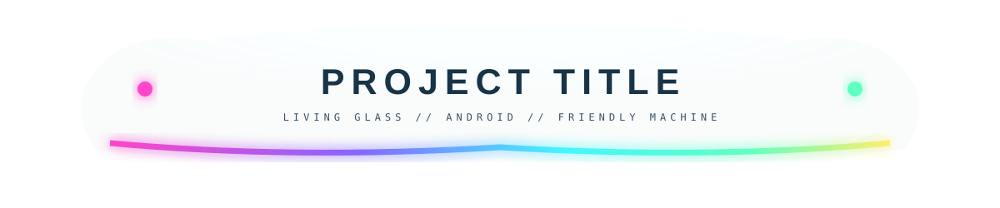
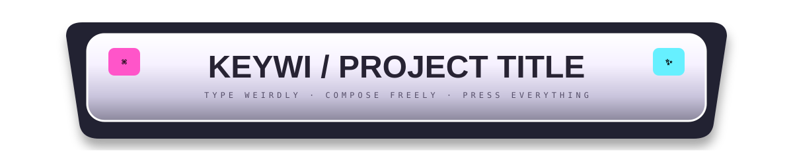
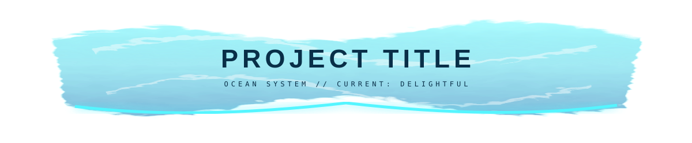
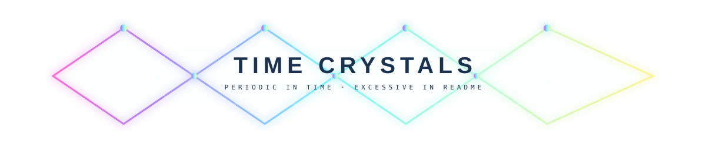
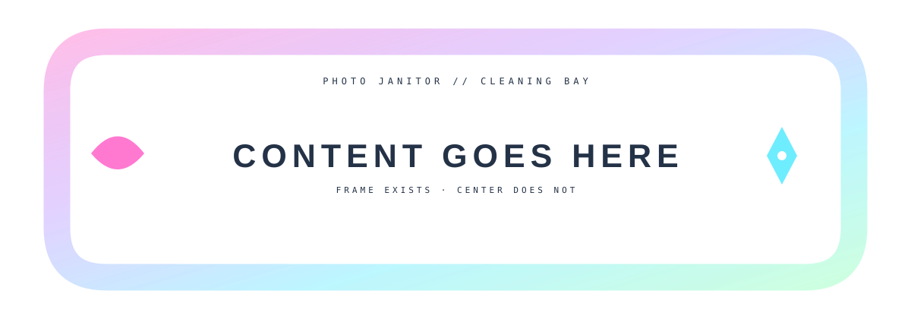

# 🧩 README LAYOUT COMPONENTS // PROJECT-SHAPED SPECIMENS

I peeked at the active BirdMachine neighborhood before making these. The recent work spans Keywi/Thumb-Key, Precipice's living-glass Android interface, TimeCrystals/KWGT, Feist, PaidIn and the other little machines. So instead of one house style, this shelf explores **families of reusable page hardware** that can be adapted per project.

---

## 01 — Living Glass / Precipice-ish

A calmer descendant of the RGB optical experiments: nearly absent glass body, soft refractive edge, opal indicator points. Useful when the project itself already has a visually rich interface and the README header should rhyme with it instead of screaming over it.

**Material grammar:** clear acrylic · RGB edge injection · opal status lights · subtle host-theme dependence.

---

## 02 — Keywi / Physical Input Object

A README title that behaves like a gigantic keyboard key rather than a banner. Chunky enough to read immediately on mobile; little command/sparkle keycaps can become project-specific pictograms.

**Material grammar:** PBT-ish keycap plastic · dark keyboard chassis · chromatic underglow · tactile objecthood.

This family wants matching section headings shaped like individual keys: `INSTALL`, `BOARDS`, `KAOMOJI`, `THEMES`, `BUILD`.

---

## 03 — PaidIn / Ocean-Dolphin-Aero Current

Not generic blue glass: a literal little slab of disturbed water. Procedural displacement makes the perimeter and caustic traces refuse to be perfectly geometric.

**Material grammar:** pool water · aqua glass · caustics · submerged luminous edge.

Could pair nicely with native Markdown tables that are visually treated as job/result readouts without turning the information itself into an image.

---

## 04 — TimeCrystals / Impossible Periodic Hardware

A title plate suspended inside a repeating spectral lattice. The lattice deliberately passes *behind and beyond* the central glass pill so the title feels like one local node in a larger periodic object.

**Material grammar:** spectral crystal lattice · translucent core · glowing nodes · impossible instrumentation.

This one could grow into section separators where the lattice periodically changes phase as you scroll.

---

## 05 — Feist / Resin Cleaning Bay Frame

A frame with an intentionally nonexistent center. The resin perimeter contains tiny inclusions and little icon-ish objects, while GitHub supplies the actual central field.

**Material grammar:** translucent cast resin · embedded inclusions · candy-machine utility object · absent center.

For a real README I'd split this into top / left / right / bottom components so screenshots, before/after comparisons or ordinary Markdown could physically occupy the bay.

---

# Component families worth building next

| family | title | divider | frame | little hardware |
|---|---|---|---|---|
| Living Glass | aero plate | fiber optic | clear corners | opal LEDs |
| Keywi | giant keycap | spacebar | keyboard deck | key badges |
| Ocean Aero | water slab | caustic ripple | pool glass | bubbles |
| TimeCrystal | lattice node | phase chain | crystal corners | spectral nodes |
| Feist | resin label | embedded filament | cleaning bay | photo chips |
| Terminal | machined bezel | light pipe | chassis rails | CRT / EQ controls |

The important thing is that these are **parts**, not finished posters. A project README can pick a title material, a framing grammar, a few dividers and one or two ridiculous controls while leaving most of the document native, readable GitHub.

> A design system for README files should behave less like wallpaper and more like a box of strange physical components.

[Topology Party](./TOPOLOGY-PARTY.md) · [Disassembled Device](./DISASSEMBLED-DEVICE.md) · [Materials Lab](./MATERIALS-LAB.md) · [Optical Negative Space](./OPTICAL-NEGATIVE-SPACE.md)
