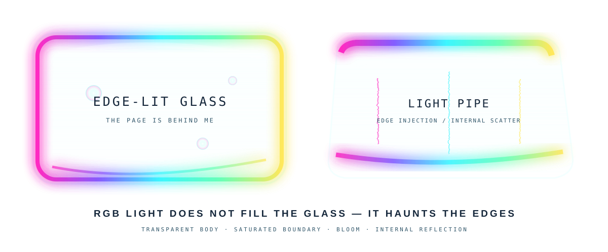
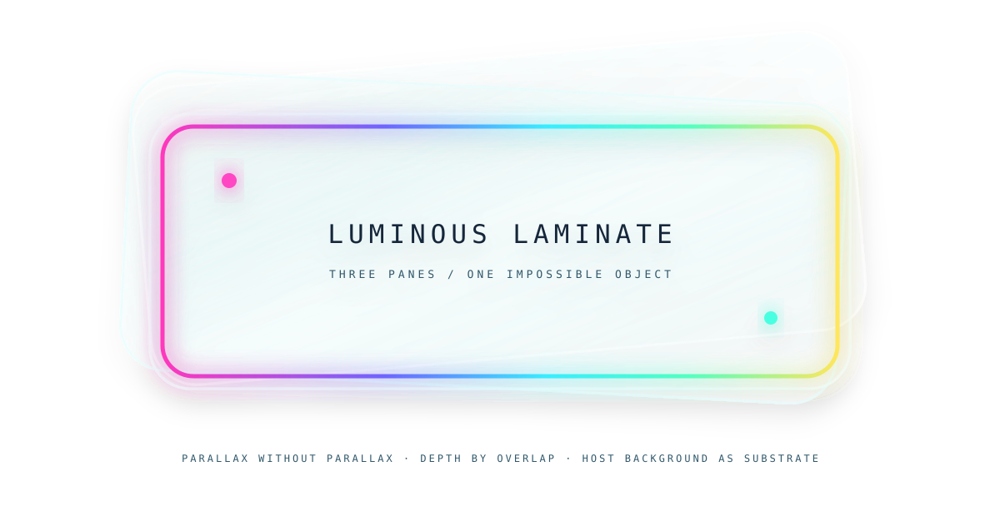
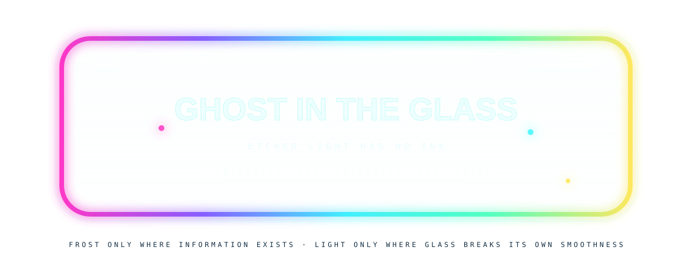

# 🧪 ADVANCED MATERIALS / RENDERING LAB

<p align="center"><sub>SVG is not merely vector drawing. SVG is a tiny procedural compositor we can sneak into a README.</sub></p>

The interesting step beyond gradients + drop shadows is to fake **material response**: refraction, surface roughness, chromatic dispersion, anisotropic-ish highlights, procedural wrinkles, specular lighting, translucent volume, optical depth, fibers, films, inclusions and interference.

# 🫧 SHELF 0 — COMPOSITE OBJECT: AERO RELIQUARY

<p align="center"></p>

This is the first attempt to stop displaying material swatches and make the materials **argue with one another inside one object**. The outer canvas is transparent, so GitHub supplies the room around it. The object itself combines brushed/machined alloy, a dark velvet cavity, dichroic translucent chassis glass, curved CRT glass with scanlines, opalescent controls, translucent resin with embedded inclusions, a holographic-ish certification plate, metal fasteners and condensation droplets.

---

# 🌈 SHELF 0.5 — RGB LIGHT TRAPPED IN CLEAR THINGS

### Edge injection / light-pipe glass
<p align="center"></p>

The useful illusion here is **not coloring the transparent body very much at all**. Saturation lives at the boundary, then bloom leaks inward. A second inner reflection and a few suspended defects imply that light has entered the material and is bouncing around under total-ish internal reflection.

### Luminous laminate / stacked clear panes
<p align="center"></p>

Three transparent panes overlap with slightly different rotations and edge illumination. There is no real parallax, but overlap, shadows, doubled boundaries and displaced reflections provide enough depth evidence that the stack should read as several physical layers.

> **RGB light does not fill the glass — it haunts the edges.**

### Etched / frosted information surface
<p align="center"></p>

Here the pane stays smooth and nearly absent everywhere except the information itself. Letterforms are treated as microscopic roughness: the *text is visible because that part of the glass scatters the trapped light*. This is closer to edge-lit engraved acrylic signage than text printed onto a transparent rectangle.

And this spawned a separate architectural experiment:

### 👉 [ENTER THE OPTICAL NEGATIVE-SPACE LAB](./OPTICAL-NEGATIVE-SPACE.md)

That page is assembled from multiple mostly-transparent components—header optic, light-pipe dividers, acrylic tabs, etched panel—with ordinary native Markdown deliberately left between them. The host page becomes substrate instead of backdrop.

---

## SHELF I — Optical Plastics, Metals & Gel

### 01 — Prismatic / Refractive Glass
<p align="center"></p>
`feTurbulence` becomes a synthetic irregular surface; `feDisplacementMap` distorts the scene beneath it; offset color channels imply chromatic dispersion. Not a ray tracer—just enough evidence for the eye to infer optically imperfect thickness.

### 02 — Iridescent / Anodized Metal
<p align="center"></p>
Nonlinear spectral bands imply thin-film color shift; macro highlights imply curvature; high-frequency noise implies manufactured surface. **Material identity happens at several spatial frequencies simultaneously.**

### 03 — Holographic Foil
<p align="center"></p>
Procedural wrinkles feed `feSpecularLighting`; a spectral substrate and diagonal microstructure sell diffraction-film behavior.

### 04 — Soft Gel / Liquid UI
<p align="center"></p>
Displaced silhouette + translucent radial volume + internal reflection + contact shadow. Frutiger Aero candy-object territory. 🫧

---

# SHELF II — THE MATERIALS CABINET HAS ESCAPED CONTAINMENT

### 05 — Dichroic Glass + Opal Fire
<p align="center"></p>
The dichroic pane treats spectral color as an angle cue: a hard-edged transparent-ish slab whose color changes aggressively across its face. Beside it, the opal uses cloudy procedural structure with tiny saturated inclusions acting as **spectral fire**.

### 06 — Satin + Velvet
<p align="center"></p>
Satin wants a long directional traveling highlight. Velvet wants deep light absorption with tiny fibers catching grazing illumination. **Same pigment ≠ same material. Light behavior is the identity.**

### 07 — Translucent Resin + Mercury Glass
<p align="center"></p>
The resin has visible objects suspended *inside* its volume. Mercury glass goes the opposite direction: mirrored bands are dirtied with procedural mottling.

### 08 — Soap Film + Pearlescent Automotive Paint
<p align="center"></p>
The soap film is almost nothing except its boundary: weak transparent body, strong spectral edge. Pearlescent paint is almost the inverse: opaque body with a broad color-shifting highlight. Sometimes **the material is primarily an edge condition**.

### 09 — CRT Glass + Water + Machined Metal
<p align="center"></p>
CRT glass gets curvature, vignette, reflection and scanline structure. Water uses turbulence as geometry and feeds it into displacement/specular lighting. Machined metal uses directional brush lines plus concentric tooling marks.

---

## 10 — Rendering Stack / Mental Model

```text
SILHOUETTE / FORM → ALBEDO → MACRO LIGHT → SURFACE FAKE → SPECULAR / DIFFUSE
→ MICROTEXTURE → EDGE / THIN-FILM CUES → VOLUME → ENVIRONMENT → BRAIN
```

**Shader thinking without shaders.**

## 11 — Next Research Problems

- water droplets that distort/recolor illuminated edges beneath them
- transparent etched bird/circuit motifs
- procedural mother-of-pearl / abalone laminated into clear controls
- glass thickness via doubled/refracted silhouettes
- colored caustics apparently cast from glass onto adjacent metal
- CD/DVD radial diffraction and embossed security foil
- fingerprints, dust, scratches and edge wear
- fake subsurface scattering for wax/jade/milky plastic
- a complete fake product photograph whose environment is GitHub itself
- **native Markdown as the literal screen inside a chassis assembled from separate optical SVG parts**
- **slice physical-looking controls into clickable navigation** 😈

## 12 — The Rule

> **We are not rendering reality. We are rendering enough evidence that the brain volunteers to render reality for us.**

[← Non-Euclidean Glasshouse](./NON-EUCLIDEAN-GEOCITIES.md) · [Optical Negative Space →](./OPTICAL-NEGATIVE-SPACE.md)
