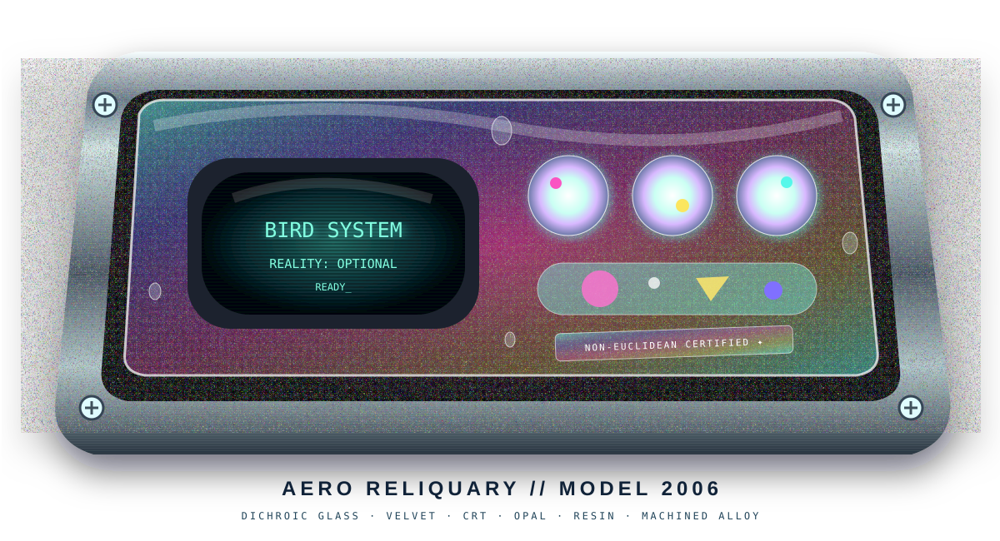
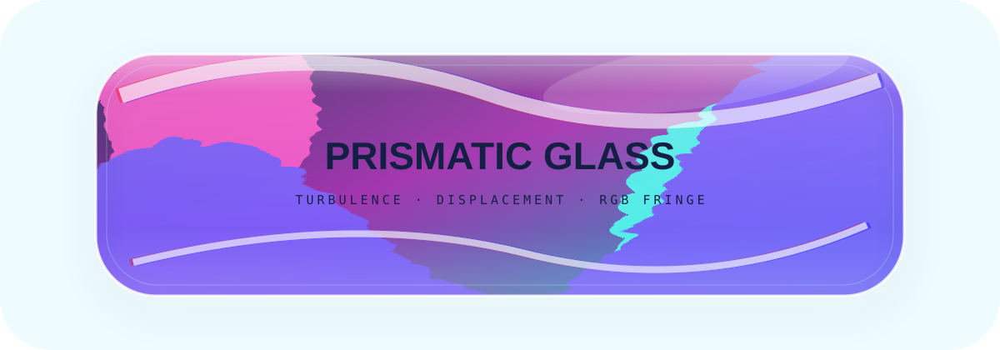
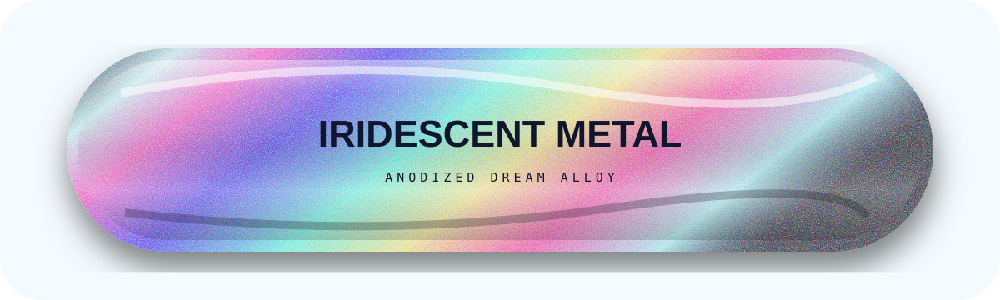
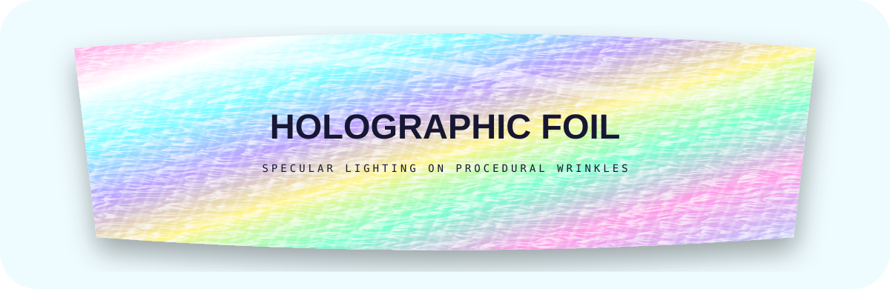
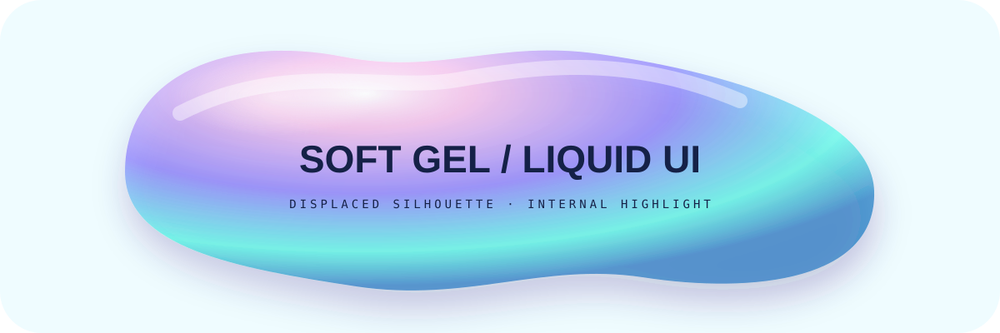
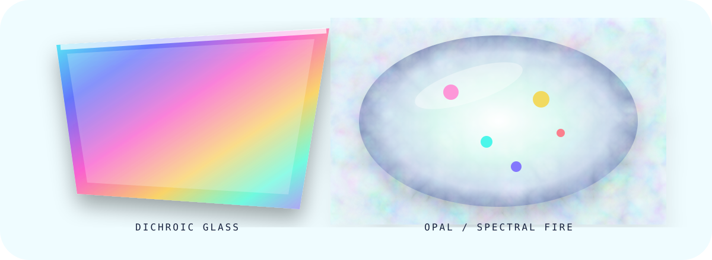
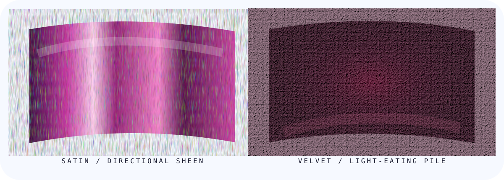
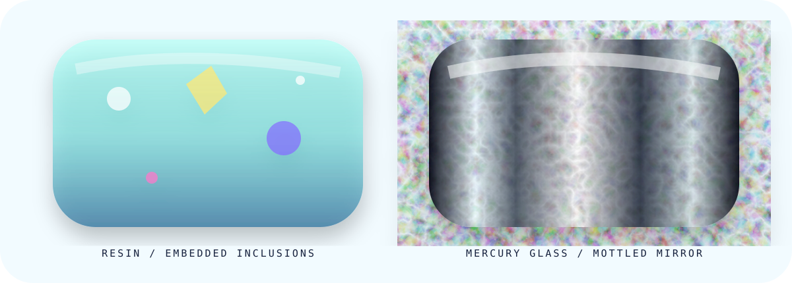
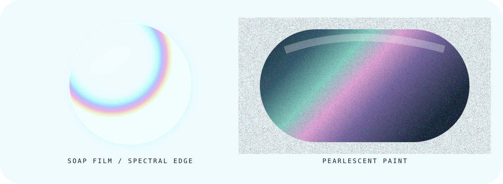
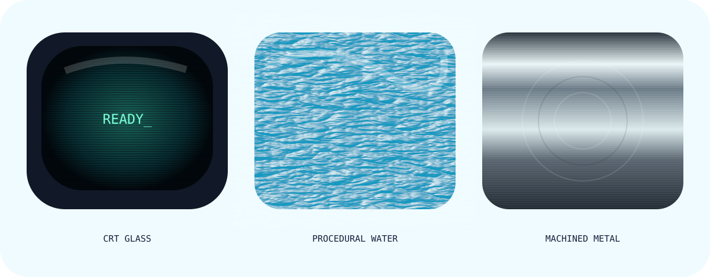

# 🧪 ADVANCED MATERIALS / RENDERING LAB

<p align="center"><sub>SVG is not merely vector drawing. SVG is a tiny procedural compositor we can sneak into a README.</sub></p>

The interesting step beyond gradients + drop shadows is to fake **material response**: refraction, surface roughness, chromatic dispersion, anisotropic-ish highlights, procedural wrinkles, specular lighting, translucent volume, optical depth, fibers, films, inclusions and interference.

# 🫧 SHELF 0 — COMPOSITE OBJECT: AERO RELIQUARY

<p align="center"></p>

This is the first attempt to stop displaying material swatches and make the materials **argue with one another inside one object**. The outer canvas is transparent, so GitHub supplies the room around it. The object itself combines brushed/machined alloy, a dark velvet cavity, dichroic translucent chassis glass, curved CRT glass with scanlines, opalescent controls, translucent resin with embedded inclusions, a holographic-ish certification plate, metal fasteners and condensation droplets.

It is intentionally tuned for the renderer we observed in Firefox Android desktop mode: the silhouette is bold, medium-frequency material cues are exaggerated, highlights are chunky enough to survive downsampling, while microtexture remains available when zoomed.

**New question:** can material boundaries make a flat SVG feel assembled rather than illustrated?

---

## SHELF I — Optical Plastics, Metals & Gel

### 01 — Prismatic / Refractive Glass
<p align="center"></p>
`feTurbulence` becomes a synthetic irregular surface; `feDisplacementMap` distorts the scene beneath it; offset color channels imply chromatic dispersion. Not a ray tracer—just enough evidence for the eye to infer optically imperfect thickness.

### 02 — Iridescent / Anodized Metal
<p align="center"></p>
Nonlinear spectral bands imply thin-film color shift; macro highlights imply curvature; high-frequency noise implies manufactured surface. **Material identity happens at several spatial frequencies simultaneously.**

### 03 — Holographic Foil
<p align="center"></p>
Procedural wrinkles feed `feSpecularLighting`; a spectral substrate and diagonal microstructure sell diffraction-film behavior.

### 04 — Soft Gel / Liquid UI
<p align="center"></p>
Displaced silhouette + translucent radial volume + internal reflection + contact shadow. Frutiger Aero candy-object territory. 🫧

---

# SHELF II — THE MATERIALS CABINET HAS ESCAPED CONTAINMENT

### 05 — Dichroic Glass + Opal Fire
<p align="center"></p>
The dichroic pane treats spectral color as an angle cue: a hard-edged transparent-ish slab whose color changes aggressively across its face. Beside it, the opal uses cloudy procedural structure with tiny saturated inclusions acting as **spectral fire**. One says *coated optical material*; the other says *light trapped inside a mineral*.

### 06 — Satin + Velvet
<p align="center"></p>
These are an especially useful pair because their geometry can be almost identical while their light response is opposite-ish. Satin wants a long directional traveling highlight. Velvet wants deep light absorption with tiny fibers catching grazing illumination. **Same pigment ≠ same material. Light behavior is the identity.**

### 07 — Translucent Resin + Mercury Glass
<p align="center"></p>
The resin has visible objects suspended *inside* its volume: bubbles, colored inclusions, little geometric debris. Mercury glass goes the opposite direction: mirrored bands are dirtied with procedural mottling.

### 08 — Soap Film + Pearlescent Automotive Paint
<p align="center"></p>
The soap film is almost nothing except its boundary: weak transparent body, strong spectral edge. Pearlescent paint is almost the inverse: opaque body with a broad color-shifting highlight. Sometimes **the material is primarily an edge condition**.

### 09 — CRT Glass + Water + Machined Metal
<p align="center"></p>
CRT glass gets curvature, vignette, reflection and scanline structure. Water uses turbulence as geometry and feeds it into displacement/specular lighting. Machined metal uses directional brush lines plus concentric tooling marks.

---

## 10 — Rendering Stack / Mental Model

```text
SILHOUETTE / FORM
       ↓
BASE ALBEDO / SPECTRAL COLOR
       ↓
MACRO LIGHTING GRADIENT
       ↓
SURFACE NORMAL FAKE (turbulence / displacement)
       ↓
SPECULAR / DIFFUSE RESPONSE
       ↓
MICROTEXTURE / GRAIN / FIBER / GROOVE
       ↓
EDGE / FRESNEL-ISH / THIN-FILM CUES
       ↓
VOLUME CUES / INCLUSIONS
       ↓
CAST SHADOW + ENVIRONMENT CUES
       ↓
THE HUMAN VISUAL SYSTEM DOES THE REST
```

**Shader thinking without shaders.**

## 11 — Next Research Problems

The composite object suggests the next frontier: material *interactions*, not merely materials.

- water droplets refracting the graphics underneath them
- scratches that cross from metal into glass differently
- true frosted glass with recognizable-but-diffuse silhouettes behind it
- procedural mother-of-pearl / abalone laminated into controls
- thresholded procedural opal fire
- CD/DVD radial diffraction and embossed security foil
- fingerprints, dust, edge wear and age
- fake subsurface scattering for wax/jade/milky plastic
- caustic light projected from glass onto adjacent metal
- chrome physically transitioning into gel
- a complete fake product photograph with a transparent page background
- **slice the composite into invisible clickable regions and turn the material object itself into navigation** 😈

## 12 — The Rule

> **We are not rendering reality. We are rendering enough evidence that the brain volunteers to render reality for us.**

[← return to the Non-Euclidean Glasshouse](./NON-EUCLIDEAN-GEOCITIES.md)
