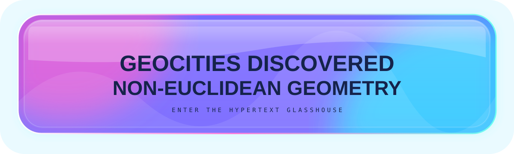
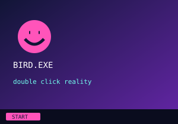
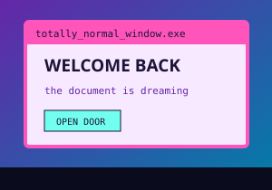
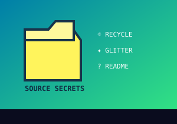

# 🫧 NON-EUCLIDEAN GEOCITIES

> **Two laboratories have collided.** SVG-TOMFOOLERY supplied the materials science: glass, glow, theme awareness, animation probes, visual ventriloquism. SHENANIGANS supplied the architecture: sliced hit-zones, fake operating systems, Markdown rooms, source-view easter eggs, and impossible spatial metaphors.
>
> This is the impact crater. 😈

<table><tr><td width="50%" align="center"><b>🫧 MATERIALS LAB</b> SVG is paint, glass, chrome, light and lies.</td><td width="50%" align="center"><b>🌀 SPATIAL LAB</b> Markdown files are rooms. Links are doors. Tables are coordinates.</td></tr></table>

---

## 01 — The Glasshouse Principle

The portal above is a single SVG whose embedded CSS attempts to react to `prefers-color-scheme`. Its transparent-looking pane contains reflections, luminous scenery, internal rim highlights and fake depth. GitHub merely believes it has displayed a rectangular image.

The important fusion rule is:

> **SVG establishes the perceived physical world. Markdown establishes topology.**

An image can convince your eyes that you are looking through glass. A link can convince the document that the glass is a door.

---

## 02 — BirdOS, But Make It Architecture

<table cellspacing="0" cellpadding="0"><tr><td width="33.333%"></td><td width="33.333%"></td><td width="33.333%"></td></tr></table>

The three images pretend to be one desktop. The destinations pretend to be applications. The applications are Markdown documents. GitHub's repo chrome is now merely the inconvenient universe surrounding our fake universe.

---

## 03 — A Window Can Be Larger On The Inside

The rectangle above occupies a few hundred pixels. Clicking it enters a document containing thousands of pixels of vertical distance. Therefore the fake window is, in a perfectly stupid hypertext sense, **larger on the inside**.

This is where the non-Euclidean bit stops being merely a joke. Visual geometry and navigation geometry are completely independent.

---

## 04 — The Brain Supplies The CSS

We cannot style the README background. Fine. Leave parts of an SVG transparent and recruit GitHub's own theme as pigment. We cannot put arbitrary Markdown *inside* a glass SVG. Fine. Put matching visual skins around native content and let perception infer a continuous object.

Ancient sliced-layout techniques weren't merely hacks. They were **perceptual compression algorithms**. 😌

---

## 05 — Door That Is Also A Mirror

<b>🪞 look into glass</b>

there appears to be another room reflected behind you

that room also contains this room

**The renderer has become a hallway.**

---

## 06 — Source Is The Back Of The Building

<!--
YOU HAVE WALKED AROUND THE GLASSHOUSE.

Rendered view: front facade.
Raw Markdown: maintenance corridor.
SVG source: materials laboratory.
Git history: geological strata.
Branches: alternate timelines.

A repository already contains a spatial metaphor.
We are simply refusing to pretend otherwise.

                         .-.
                    .--(o o)--.
                   /    |O|    \
                  /  GLASS BIRD \
                 '-------------'
-->

There are now at least four navigable versions of the same object: rendered Markdown, raw Markdown, SVG source, and commit history. Branches add alternate universes for free.

---

## 07 — Collision Experiments Next

- theme-aware **glass BirdOS** desktop with 3×3 clickable hotspot slicing
- fake translucent windows whose content continues as real Markdown below them
- a branch that deliberately presents itself as an alternate timeline
- navigation where going “back” returns somewhere visually impossible
- fake glass tabs that route among Markdown rooms
- an SVG hallway chopped into linked perspective planes
- an Escher-ish staircase built from anchors that jump *up* when you click “down”
- `details` recursion styled as reflections within reflections
- light mode and dark mode showing subtly different *maps*, not merely colors
- a room whose only exit is hidden in source view
- use Git history itself as part of the fiction: older commits as archaeological layers

---

<b>WELCOME TO THE IMPACT CRATER.</b> the website is not where the website appears to be.

