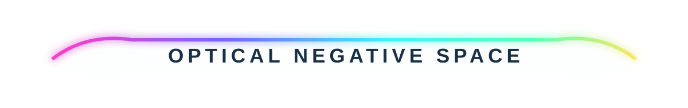
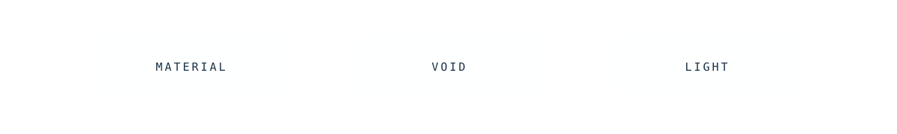

The page color you see around these objects is not painted into them. **GitHub is doing unpaid set design.** The experiment here is to build a visual system from separate transparent optical components and let native Markdown occupy the empty regions between them.

## The substrate is missing on purpose

Normal image-led README design tends to arrive as rectangular posters interrupted by text. Here, every SVG is mostly *absence*. It contributes only edges, glow, reflections, little pieces of apparent glass, and lets the host page remain visible through everything else.

That means light/dark mode isn't merely a palette toggle. It changes the apparent **material density** of the same objects: clear acrylic in light mode; smoked luminous glass in dark mode.

The tab strip above is three panes with almost no body color. Their existence is communicated mostly by faint borders and illuminated lower edges. Eventually these can be physically split into three linked SVGs so the apparently continuous control becomes navigation.

## Native Markdown inside the machine

This paragraph is not inside an SVG. There is no fake screenshot behind it. Yet if the surrounding optical grammar works, the eye starts treating the Markdown as content **inside the same interface** anyway.

> ### `// HOST CONTENT CHANNEL`
> Markdown remains selectable, accessible, copyable, searchable, linkable and delightfully ordinary. The decorative machine exists around it rather than flattening it into pixels.

That division of labor is interesting: **SVG owns atmosphere; Markdown owns information.**

## Frost only where information exists

The etched panel is nearly empty glass. The lettering is the rough surface: a localized frosted region that catches light because it disrupts an otherwise smooth pane. The visual trick is therefore inverted—rather than drawing text *on* glass, we imply that text is a physical change *to* glass.

This can become much stranger. Imagine a nearly invisible full-width pane where only a bird silhouette, heading, circuit trace or map catches edge light. In light mode it whispers; in dark mode it fluoresces.

## Negative-space architecture

<table><tr><td width="33%" align="center"><b>GLASS</b> barely exists</td><td width="33%" align="center"><b>GITHUB</b> becomes environment</td><td width="33%" align="center"><b>MARKDOWN</b> becomes interface content</td></tr></table>

The important part is what we *don't* draw. Every transparent pixel is a portal back to the host renderer. Every gap between assets is usable layout space. Every native heading becomes a component without pretending to be one.

### Next mutations

- physically slice the acrylic tabs into independent clickable components
- use narrow transparent SVGs as luminous **rails** running alongside native Markdown sections
- construct corner-only glass frames: four tiny SVGs, enormous empty center
- etched bird/circuit motifs that appear differently against GitHub light/dark substrates
- faux glass shelves that seem to support ordinary Markdown tables
- floating droplets as tiny standalone assets placed between paragraphs
- transparent optical breadcrumbs whose only visible pixels are glowing nodes and connecting fibers
- build a whole fake device where **the center screen is literally ordinary Markdown between top/bottom chassis assets**
- abuse tables to put left/right optical hardware around a native-content center column
- investigate whether repeated transparent assets can make the page feel like one continuous physical object despite being separated by actual DOM/Markdown flow

THE MOST IMPORTANT MATERIAL IN THIS PAGE IS THE PART WE DIDN'T RENDER.

[← Materials Lab](./MATERIALS-LAB.md) · [← Non-Euclidean GeoCities](./NON-EUCLIDEAN-GEOCITIES.md)
