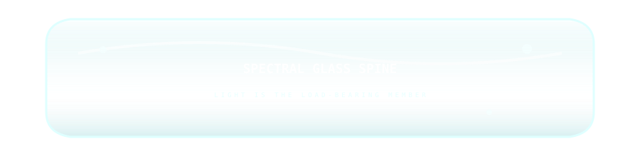
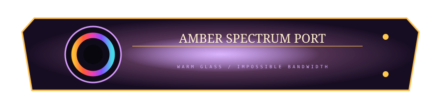

# 🧬🌈 PALETTE MUTATIONS

> We found three promising organisms. Do not stabilize them. Breed them.

The first chromatic cabinet established several color families. This page pushes hardest on the ones that read best in actual GitHub dark-mode screenshots: **sinebow**, **amber/ultraviolet**, and the nearly-there **cobalt/vermillion**.

---

## 01 // COBALT REFRACTOR — revision of the almost-one

The first cobalt panel was too graphically flat: nice palette, insufficient *object*. So this mutation keeps cobalt as a large structural body but makes vermillion/orange/yellow an **optical energy event** rather than a decorative stripe.

Warm ivory stays because it gives the saturated colors somewhere quiet to push against.

**Useful rule:** if two saturated colors are fighting, assign them different jobs. Cobalt is mass. Vermillion is energy.

---

## 02 // SPECTRAL GLASS SPINE

This is closer to the thing I want hiding inside future README furniture: almost-colorless transparent glass whose visual identity comes from a **sinebow conductor trapped inside it**.

Instead of rainbow plastic, imagine clear optical hardware catching stray spectral contamination along bevels, bubbles and curved surfaces.

The spectrum can become a continuous visual bus across otherwise unrelated components.

---

## 03 // AMBER SPECTRUM PORT

Amber/UV gets invaded by a deliberately constrained spectrum. The warm smoked-glass body remains coherent while the port implies absurd optical bandwidth.

This feels like a promising way to use sinebow without making every object itself rainbow-colored: **full spectrum belongs to transmitted light; materials keep smaller palettes.**

---

## 04 // THE COLOR GRAMMAR IS STARTING TO EXIST

| phenomenon | color behavior |
|---|---|
| chassis / physical mass | compact 2–3 color palette |
| transparent optical body | nearly neutral + environmental tint |
| power | vermillion → orange → amber |
| photon/data bus | full sinebow |
| active biological/weird subsystem | chartreuse / green-yellow |
| cold fluid / water / glass | mineral cyan / aqua |
| labels / paper / service markings | warm ivory |
| deep cavity | near-black biased toward local body hue |

This isn't a mandatory palette. It's a **fake physics system**. Different projects can violate it differently.

---

## 05 // NEXT EXPERIMENT: CHROMATIC NERVOUS SYSTEM

The next device should stop presenting these as swatches and make color traverse a README:

**WHITE INPUT** → prism → **SINEBOW BUS** → disappears behind native Markdown → individual spectral channels reappear at distant modules → some recombine → output returns white-ish but contaminated.

The fun part is that the connections can be physically impossible. A strand may enter the right edge on one section and emerge from the left edge three screens later. A yellow channel can illuminate an amber glass component. Cyan can disappear into water. Magenta can become an LED on an unrelated service hatch.

The reader's visual cortex will perform cable management for us.

> **GitHub supplies the DOM. Human perception supplies the motherboard.**

[Chromatic Furniture](./CHROMATIC-FURNITURE.md) · [Continuity Crimes](./CONTINUITY-CRIMES.md) · [Materials Lab](./MATERIALS-LAB.md)
