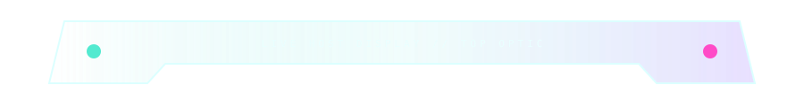
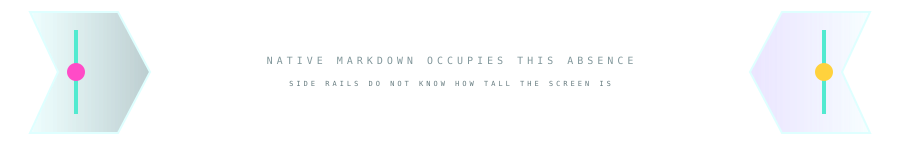
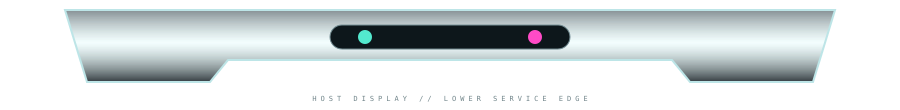
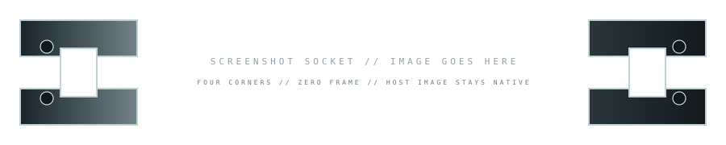
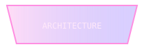
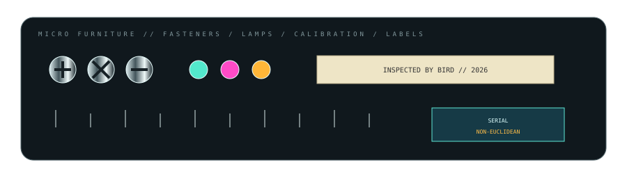
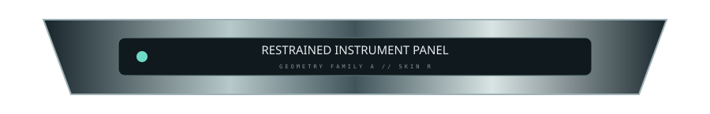
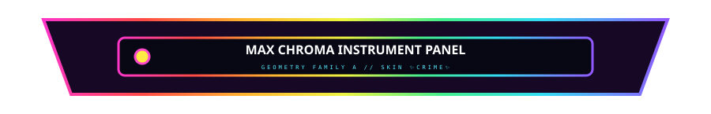
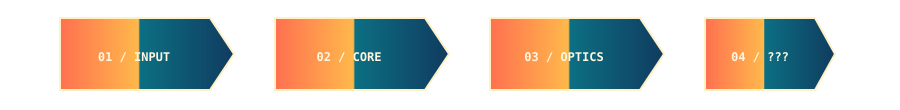
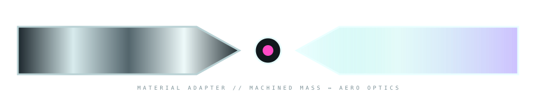

# 🐰🕳️ RABBIT CHAMBER 05 // THE HOST BECOMES MATERIAL

> **GitHub is no longer the page behind the furniture. GitHub is one of the materials the furniture is made from.**

This chamber breeds the requested families together: four-piece live displays, vertical rails, micro-furniture, screenshot hardware, real linked controls, geometry-compatible skins, and restrained vs max-chroma modes.

---

## 01 // FOUR-PIECE LIVE DISPLAY





### This is the screen.

This heading is real. So is this paragraph. **There is no SVG behind it.** GitHub's page background is literally the display substrate.

```js
const screen = github.render(markdown);
const bezel = "imaginary";
```

- selectable text
- native links
- native syntax highlighting
- responsive wrapping
- dark/light mode inherited from the host




The repeated side-rail asset is intentionally dishonest: one rail pair above, another below, and the brain interpolates a tall continuous enclosure through the native content between them. A later generation can make several side segments with different lamps/marks so the repetition feels like modular extrusion.

---

## 02 // SCREENSHOT HARDWARE WITHOUT TOUCHING THE SCREENSHOT



> **NATIVE SCREENSHOT SLOT** — put the project's ordinary image here.


The corner sockets establish attachment; the lower bezel establishes gravity. The screenshot itself can remain a normal Markdown image with its own dimensions and alt text.

This is probably the most practical furniture family for Keywi/Precipice/etc.: screenshots are the content, hardware is merely stage dressing.

---

## 03 // ACTUALLY CLICKABLE PHYSICAL TABS

<table><tr>
<td><a href="#install"></a></td>
<td><a href="#gallery"></a></td>
<td><a href="#architecture"></a></td>
<td><a href="#releases"></a></td>
</tr></table>

These are not faux controls anymore. Each apparent glass button is a separate image wrapped in a real anchor. GitHub still owns navigation; we only manufacture the switchgear.

<a id="install"></a>
### INSTALL

The tab above genuinely jumps here.

<a id="gallery"></a>
### GALLERY

Likewise here.

<a id="architecture"></a>
### ARCHITECTURE

And here.

<a id="releases"></a>
### RELEASES

The fourth switch works too. Tiny image-map energy, but made from README-safe Lego.

---

## 04 // MICRO-FURNITURE SHEET



A useful design system needs punctuation smaller than a section header. This sheet explores:

- Phillips / slotted / hostile mystery fasteners,
- green / magenta / amber status lamps,
- an inspection sticker,
- spectral calibration ticks,
- a serial plate.

These should eventually become individual tiny assets rather than one sheet. They can live beside captions, tables, warnings, release notes, compatibility labels and screenshots without taking over the page.

The goal is **visual accent vocabulary**.

---

## 05 // SAME GEOMETRY, TWO PERSONALITIES

### Restrained instrument skin



### MAXIMUM CHROMATIC CRIME



These have deliberately identical outer geometry and internal layout.

That means we can start treating shape and material as separate concerns:

```text
geometry: instrument-panel-A
skin: restrained | maxchroma | aero | amber-uv | citrus | velvet | resin
```

A future README kit could literally be re-skinned by changing asset paths while preserving all surrounding Markdown structure.

This is where the experiment starts behaving suspiciously like a component library.

---

## 06 // RESTRAINED PAGE GRAMMAR


### Features

Use sparse furniture. Let whitespace and GitHub typography do most of the work. Add one cyan status light, machined surfaces, small labels, occasional glass.

> The restrained kit should feel like expensive laboratory hardware that happens to contain documentation.


Good targets: serious project READMEs, architecture docs, installation instructions, release pages.

---

## 07 // MAX-CHROMA PAGE GRAMMAR




### THE DOCUMENT HAS BEEN OVERCLOCKED

Sinebow continuity rails. Hot magenta couplers. Acid yellow indicators. Cyan optical edges. Amber status lamps. Violet glass. Coral enamel. Absolutely unnecessary photon budget.



The trick is keeping **geometry disciplined while color becomes feral**. If both shape and palette scream simultaneously, the furniture loses hierarchy. Max-chroma works better when the chassis still knows how to behave.

> **Chromatic violence; typographic manners.**

---

## 08 // INTERCHANGEABLE SKIN CONTRACT

For this to become reusable rather than bespoke, future families should obey a tiny contract:

| property | rule |
|---|---|
| canvas | same width / height per geometry family |
| attachment points | same coordinates |
| negative-space aperture | same bounds |
| text-safe area | same bounds |
| semantic role | unchanged |
| palette/material | free to mutate |
| highlights/noise | free to mutate |

That lets `panel-A/aero.svg`, `panel-A/amber-uv.svg`, `panel-A/maxchroma.svg`, etc. behave as drop-in replacements.

---

# 🐇 NEXT: MAKE IT BORING ENOUGH TO USE EVERYWHERE

The paradoxical next step is infrastructure:

- split the micro-furniture sheet into reusable atoms;
- create geometry-family directories with multiple skins;
- build matched top/side/bottom live-display pieces per skin;
- create screenshot socket families for phone portrait, phone landscape, desktop and square art;
- make linked nav tabs with active/inactive states;
- make paired cable-entry/cable-exit assets that preserve channel identity across scroll distance;
- create one **realistic project README template** that uses the system sparingly;
- create one **MAXIMUM README template** that behaves like a lost Winamp skin became sentient inside GitHub;
- document safe GitHub rendering patterns vs things GitHub sanitizes or mangles.

At that point the laboratory becomes a toolbox.

> **We are not decorating Markdown anymore. We are giving Markdown a chassis.**

[Kit 04](./RABBIT-CHAMBER.md) · [Kit 03](./FURNITURE-KIT-03.md) · [Kit 02](./FURNITURE-KIT-02.md) · [Materials Lab](./MATERIALS-LAB.md)
