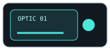
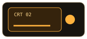
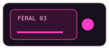
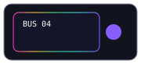
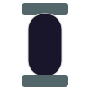
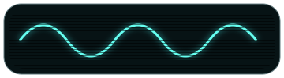

# 🐰🔩 RABBIT CHAMBER 06 // THE GRID IS THE CHASSIS

> GitHub insists on cell padding and borders. Fine. **Those are no longer gaps. They are rack seams.**

The last chamber revealed an important constraint: adjacent SVG fragments inside separate table cells cannot actually touch. Trying to hide GitHub's table geometry makes the furniture look accidentally disconnected.

So this generation changes the fiction.

**A border is a panel seam. Padding is a gasket / service gap / recessed bay. Each cell is a removable module.**

---

## 01 // RACK DRAWERS — STOP TRYING TO TOUCH

<table>
<tr><th>BUS</th><th>module</th><th>state</th><th>field note</th></tr>
<tr><td></td><td><b>renderer</b></td><td><code>READY</code></td><td>cyan optical drawer</td></tr>
<tr><td></td><td><b>phosphor</b></td><td><code>WARM</code></td><td>amber CRT service bay</td></tr>
<tr><td></td><td><b>rabbit</b></td><td><code>FERAL</code></td><td>magenta containment drawer</td></tr>
<tr><td></td><td><b>host</b></td><td><code>LIVE</code></td><td>sinebow data coupler</td></tr>
</table>

The dark margin inside every SVG deliberately continues GitHub's cell background. The visible object is inset. **Padding now looks intentional.**

---

## 02 // BORDER EATER // A SEAM CAP

Instead of crossing the forbidden border, put a fastener immediately on either side of it.

<table>
<tr><th>input</th><th>coupler</th><th>payload</th></tr>
<tr><td></td><td></td><td><b>Markdown remains native.</b> The apparent cable terminates in hardware at every cell boundary.</td></tr>
<tr><td></td><td></td><td><b>Boundaries become connectors.</b> Discontinuity reads as engineering rather than failure.</td></tr>
</table>

This is probably the strongest general rule discovered so far: **never draw a line that promises to cross a cell boundary. Terminate it. Give the boundary a job.**

---

## 03 // GLASS TUBE BUS — SERIAL SEGMENTS

<table>
<tr><th>segment</th><th>instrument</th><th>reading</th></tr>
<tr><td></td><td>01 / intake</td><td>photons admitted</td></tr>
<tr><td></td><td>02 / optics</td><td>cyan carrier</td></tr>
<tr><td></td><td>03 / chroma</td><td>spectral contamination ✨</td></tr>
<tr><td></td><td>04 / thermal</td><td>deliciously warm</td></tr>
<tr><td></td><td>05 / output</td><td>reality returned</td></tr>
</table>

The tube itself does **not** pretend to be continuous. Every row is a glass capsule with metal collars at top and bottom. Repetition creates a vertical bus rhythm while the table borders become literal inter-module joints.

---

## 04 // MINIATURE CRT WAVEFORM CELLS 📺

<table>
<tr><th>scope</th><th>signal</th><th>diagnosis</th></tr>
<tr><td></td><td>render loop</td><td>calm-ish</td></tr>
<tr><td></td><td>build loop</td><td>spicy</td></tr>
<tr><td></td><td>rabbit loop</td><td>no adult supervision</td></tr>
</table>

Fuzzy phosphor, scanlines, bloom and slightly misregistered RGB return — but now at **table-cell scale**. These can replace ordinary sparklines without surrendering the surrounding data to an image.

---

## 05 // ROW NUMBER HARDWARE

<table>
<tr><td></td><td><b>Acquire</b> Clone / download / find mysterious artifact.</td></tr>
<tr><td></td><td><b>Install</b> Put the machine where machines go.</td></tr>
<tr><td></td><td><b>Ignite</b> Press the button that absolutely should have a cover.</td></tr>
<tr><td></td><td><b>Observe</b> Take notes before causality reasserts itself.</td></tr>
</table>

This should work nicely for Keywi installation steps, release histories, feature matrices and project roadmaps.

---

## 06 // DOUBLE-ENDED CLAMP TABLE

<table>
<tr><th>left organ</th><th>native payload</th><th>right organ</th></tr>
<tr><td></td><td><b>Optical renderer</b> Real text physically detained between two decorative organs.</td><td></td></tr>
<tr><td></td><td><b>Thermal service channel</b> Padding becomes deliberate breathing room around the specimen.</td><td></td></tr>
<tr><td></td><td><b>Maximum chromatic crime</b> The table border is now the seam between removable chassis plates.</td><td></td></tr>
</table>

This is the mutation I expect to survive into the actual kit: the table is visibly a rack of independent cartridges, not one picture chopped up by GitHub.

---

## 07 // SCREENSHOT → METADATA DOCK

> **SCREENSHOT SLOT // native image belongs immediately above this dock.** The furniture does not frame the screenshot; it behaves like the hardware tray the screenshot is resting on.

<table>
<tr><td></td><td><b>capture</b></td><td>Android / Firefox</td></tr>
<tr><td></td><td><b>render</b></td><td>GitHub dark</td></tr>
<tr><td></td><td><b>subject</b></td><td>project UI / specimen</td></tr>
</table>

The mandatory border between dock and metadata is useful here: it reads as the physical seam between **display tray** and **instrument rack**.

---

## 08 // TWO SKINS, IDENTICAL RACK GEOMETRY

### restrained laboratory rack

<table>
<tr><td></td><td><b>INPUT</b></td><td>native content</td></tr>
<tr><td></td><td><b>CORE</b></td><td>stable</td></tr>
<tr><td></td><td><b>OUTPUT</b></td><td>nominal</td></tr>
</table>

### SINEBOW CRT ARCADE FAMILY 😈🌈📺

<table>
<tr><td></td><td><b>INPUT</b></td><td>consume photons</td></tr>
<tr><td></td><td><b>CORE</b></td><td>overclock beauty</td></tr>
<tr><td></td><td><b>OUTPUT</b></td><td>taste rainbow / become machine</td></tr>
</table>

Same dimensions. Same content structure. Same semantics. Different crime.

---

## 09 // NEW RULES FROM THE CONSTRAINT

GitHub gives us three immutable physical properties:

1. **cell padding** → gasket, recess, breathing space, cartridge clearance;
2. **cell border** → rack seam, panel joint, connector boundary, measurement grid;
3. **row striping** → alternating module material / depth cue.

So future furniture should generally be designed as **bounded modules**, not sliced panoramas. When continuity matters, use repetition, aligned landmarks, matching color channels, connector caps, or semantic continuity rather than literal uninterrupted pixels.

> Constraint accepted. Constraint metabolized. Constraint is now furniture. 🐰💗
