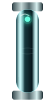

# 🐰📺🌈 RABBIT CHAMBER 07 // NOTHING SHOULD BE MOVING

> Declarative SVG animation enters the furniture lab. If GitHub lets this survive, the README is now an instrument panel with a pulse.

This chamber is intentionally a compatibility test as much as a design experiment. Each specimen uses self-contained SVG animation: no JavaScript, no CSS dependency, no external machinery.

---

## 01 // THE PHOTON BUS IS ALIVE

A restrained chassis, an irresponsible spectrum, and one luminous packet traversing the optical path. The geometry stays disciplined so motion gets to be the crime.

**Test:** does the photon visibly travel on GitHub's rendered Markdown page?

---

## 02 // FUZZY CRT HEARTBEAT 📺💚

<table>
<tr><th>scope</th><th>signal</th><th>interpretation</th></tr>
<tr><td></td><td><b>render loop</b></td><td>phosphor trace should crawl continuously</td></tr>
<tr><td></td><td>control</td><td>static previous-generation scope</td></tr>
</table>

The animated scope keeps the old fuzzy CRT vocabulary: dark curved glass, scanline texture, phosphor bloom, slight ghosting and a tiny asynchronous status lamp. The waveform itself translates beneath a clipped glass aperture.

If this works, we can breed waveform variants: ECG-ish telemetry, audio scope, noisy build activity, square-wave CI, spectral RGB disagreement and tiny radar sweeps.

---

## 03 // GLASS TUBE // PHOTONS HAVE GRAVITY NOW

<table>
<tr><th>organ</th><th>state</th><th>native report</th></tr>
<tr><td></td><td><b>LIVE</b></td><td>one packet should descend through luminous glass, change color, and return</td></tr>
<tr><td></td><td>STATIC</td><td>old tube retained as visual control</td></tr>
</table>

This is the first lighting mutation for the tube family. The glass now has several simultaneous depth cues: dark internal volume, bright edge transmission, narrow white reflection, curved highlight, steel collars and a blooming emitter inside it.

The next version should become nastier: condensation specks, imperfect refraction, tiny scratches, a colored caustic on the opposite wall and a dim reflected ghost of the moving photon.

---

## 04 // SERIAL BUS EXPERIMENT // FIVE FILES PRETEND TO SHARE A NERVOUS SYSTEM

The fun version of the table-border constraint is **temporal continuity**. We cannot make one uninterrupted object cross five GitHub rows. We *can* make five independent objects perform a coordinated event.

<table>
<tr><td></td><td><b>01 / intake</b></td><td>packet enters machine</td></tr>
<tr><td></td><td><b>02 / optics</b></td><td>same geometry, independent clock</td></tr>
<tr><td></td><td><b>03 / chroma</b></td><td>future variant receives phase offset</td></tr>
<tr><td></td><td><b>04 / thermal</b></td><td>border becomes a temporal seam</td></tr>
<tr><td></td><td><b>05 / output</b></td><td>reality exits slightly overclocked</td></tr>
</table>

This specimen currently establishes whether repeated animated assets remain animated when GitHub embeds them several times. If yes, the next generation gets five phase-specific files so the packet appears to fall **through the table itself**.

---

## 05 // MOTION VOCABULARY TO BREED IF THE HOST SURVIVES

| motion primitive | furniture use | desired character |
|---|---|---|
| path-following photon | cable / optical bus | smooth, hypnotic |
| clipped waveform translation | CRT / meter | fuzzy laboratory equipment |
| opacity pulse | lamps / warnings | asynchronous machine life |
| gradient drift | glass / sinebow chassis | slow oily interference |
| transform rotation | calibration dial / fan | mechanical |
| dash-offset | data cable | restrained digital flow |
| mask reveal | scope trace | electron-beam persistence |
| phase-offset particles | segmented table bus | impossible continuity |

The rule should be **ambient motion, not banner-ad motion**. Most furniture remains still. A few components quietly imply that the document is powered.

---

## 06 // NEXT MUTATIONS 😈

- five phase-offset glass-tube modules so a single photon apparently crosses table rows;
- fuzzy CRT with a beam-head hotspot and fading persistence trail;
- amber scope family and maximum-sinebow RGB misregistration family;
- animated micro-meter with a wandering load bar but real Markdown number beside it;
- tiny rotating calibration reticle;
- breathing resin/glass interference gradient, *very* slow;
- connector stubs where a light packet arrives, flashes the socket, then vanishes;
- a full live-display lower bezel with two unsynchronized status lamps;
- `prefers-reduced-motion` experiment if GitHub's SVG handling preserves embedded style media queries;
- compare direct SVG rendering vs README embedding so we know exactly which host layer murders what.

> **The document is not animated. The hardware bolted to it has simply begun operating.** 💗
