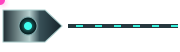
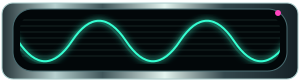
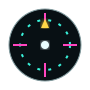
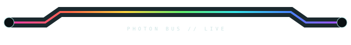

# 🐰⚡ RABBIT CHAMBER 08 // THE INVISIBLE WIRING PROBLEM

> The host gives us borders. Fine. The machine will communicate through time instead of space.

Generation 08 stops asking animated SVG to be decoration and starts treating **motion as layout information**. Native Markdown remains the data plane. Tiny animated organs tell the eye what is connected, alive, receiving, loading, or calibrated.

---

## 01 // SIGNAL WITHOUT A WIRE

<table>
<tr><th>receiver</th><th>channel</th><th>native payload</th></tr>
<tr><td></td><td><b>OPTICAL / A</b></td><td>The packet approaches from nowhere, strikes the socket, and the socket reacts.</td></tr>
<tr><td></td><td><b>OPTICAL / B</b></td><td>GitHub's border is not hidden. It becomes the bulkhead between instruments.</td></tr>
<tr><td></td><td><b>OPTICAL / C</b></td><td>Repeated motion makes the eye infer a shared bus outside the visible document.</td></tr>
</table>

There is deliberately **no drawn connection between rows**. If this still reads as one system, animation has become semantic glue.

---

## 02 // MICRO-METERS HAVE STARTED LYING BEAUTIFULLY

<table>
<tr><th>subsystem</th><th>load</th><th>real text</th><th>condition</th></tr>
<tr><td>renderer</td><td></td><td><b>63%</b></td><td>nominal-ish</td></tr>
<tr><td>optics</td><td></td><td><b>91%</b></td><td>consuming photons</td></tr>
<tr><td>rabbit chamber</td><td></td><td><b>???</b></td><td>unsupervised</td></tr>
</table>

The meter is alive but the useful number remains selectable native text. This is a nice division of labor: **SVG conveys state-feel; Markdown conveys truth.**

---

## 03 // PHOSPHOR PERSISTENCE / BEAM HEAD 📺

This scope adds a moving electron-beam hotspot, ghosted magenta misregistration, scanlines and a traveling trace. It should feel less like an animated icon and more like a tiny piece of questionable surplus laboratory equipment.

| scope | signal | diagnosis |
|---|---|---|
|  | render | phosphor animal is awake |
|  | legacy | first-generation heartbeat |

---

## 04 // CALIBRATION ORGAN

<table><tr><td></td><td><b>OPTICAL DATUM / CAL 08</b> Rotating hardware can act like punctuation beside otherwise boring documentation. The motion is intentionally slow enough to become environmental rather than demanding.</td></tr></table>

This wants siblings: tiny gyro, mechanical iris, fan, tape reel, rotary selector and a radar sweep.

---

## 05 // THE TABLE IS A BACKPLANE NOW

<table>
<tr><td></td><td><b>INPUT</b></td><td>ordinary native content enters</td><td></td></tr>
<tr><td></td><td><b>PROCESS</b></td><td>host remains readable and selectable</td><td></td></tr>
<tr><td></td><td><b>OUTPUT</b></td><td>machine returns suspiciously pretty data</td><td></td></tr>
</table>

This is the direction I think matters most for the reusable kit: **cells are equipment bays**. Padding is clearance. Borders are chassis seams. Alternating row color is material/depth. Motion is the electrical system.

---

## 06 // MAX-CHROMA INSTRUMENT BENCH 😈🌈

<table>
<tr><td></td><td></td><td></td></tr>
<tr><td><b>CAL</b></td><td><b>LIVE SCOPE</b></td><td><b>LOAD</b></td></tr>
<tr><td>datum drifting</td><td>RGB ghosts encouraged</td><td>beauty exceeds specification</td></tr>
</table>

The important restraint: the rainbow is the **signal**, not necessarily the chassis. Dark glass + machined neutral metal gives max-chroma something to punch through.

---

## 07 // NEXT BREEDING TARGETS

The phase-offset vertical tube bus is still the prize, but it deserves proper individual timing rather than five clones blinking together. Next generation should breed:

- `tube-phase-01..05.svg`: one apparent photon falls through five physically separate rows;
- RX/TX socket pair: packet disappears into one component and emerges from another later;
- slow interference glass whose material seems alive even when no event occurs;
- a **native table with an animated left-side nervous system** whose pulses correspond to specific rows;
- waveform families: cyan sine, amber dirty telemetry, magenta/cyan disagreement, RGB spectral scope;
- tiny binary/status lamps with deliberately different periods so the machine never loops obviously;
- animated screenshot lower bezel: capture lamp → processing lamp → ready lamp;
- motion skins sharing exact geometry with static skins, so animation can be swapped without touching Markdown;
- reduced-motion static counterparts for every genuinely reusable animated primitive.

### New grammar

`geometry = hardware`  
`native Markdown = information`  
`color = channel identity`  
`animation = causality`  
`GitHub borders = physical seams`

> **We couldn't run a wire through the table, so we taught the table to hallucinate electricity.** 💗⚡
