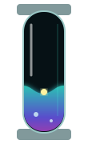
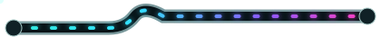

# 🐰🧪 RABBIT CHAMBER 09 // HYDRAULIC NERVOUS SYSTEM

> Apparently the documentation has acquired bodily fluids. This seems fine.

08 proved GitHub will happily let our little SVG organs move. 09 asks what happens when the machine stops being purely electrical. **Liquid becomes another semantic channel:** level, pressure, flow, accumulation, cooling, reagent, mood.

---

## 01 // LIQUID TELEMETRY COLUMN

<table><tr><td></td><td><b>COOLANT / CHROMA REAGENT</b>  The meniscus breathes. Bubbles rise independently. The narrow white reflection stays glassy while the fluid glows underneath it.  <code>level = state</code> · <code>color = medium</code> · <code>bubbles = activity</code></td></tr></table>

The old glass tube wanted to be a wire. This one admits what it really wanted to become: **laboratory plumbing**.

---

## 02 // FLUID WINDOW / DATA HAS A MENISCUS NOW

A broad reservoir is useful where a progress bar would be too ordinary. The liquid surface is deliberately asymmetrical and slow. Tiny bubbles provide a second time scale so it doesn't read as a single canned loop.

| reservoir | level | interpretation |
|---|---:|---|
| chroma coolant | 61% | stable, pretty, faintly radioactive-looking |
| rabbit reagent | ??? | do not taste |

This could become a **section divider that is also state**: build health, coverage, release readiness, migration progress, whatever deserves to slosh.

---

## 03 // CAPILLARY BUS

Now we're mixing metaphors irresponsibly. A transparent pipe carries luminous droplets through a physical bend. Unlike the photon bus, the payload has apparent viscosity and little particulate companions.

The bend matters: straight lines read like UI decoration. A pipe that has to route around imaginary hardware makes the page feel like it has an unseen interior.

---

## 04 // FLUID CELLS BESIDE NATIVE DATA

<table>
<tr><th>organ</th><th>medium</th><th>reading</th><th>native diagnosis</th></tr>
<tr><td></td><td><b>cyan coolant</b></td><td>FLOW</td><td>renderer thermals nominal</td></tr>
<tr><td></td><td><b>violet reagent</b></td><td>ACTIVE</td><td>semantic extraction fermenting nicely</td></tr>
<tr><td></td><td><b>magenta mystery</b></td><td>DO NOT OPEN</td><td>probably documentation</td></tr>
</table>

The mandatory cell border now reads naturally as a **containment bulkhead**. This is exactly the kind of mutation where GitHub's limitations become free industrial design.

---

## 05 // MIXED-SIGNAL BENCH

<table>
<tr><td></td><td></td><td></td></tr>
<tr><td><b>ELECTRICAL</b></td><td><b>FLUID</b></td><td><b>LOAD</b></td></tr>
<tr><td>waveform</td><td>pressure / level</td><td>activity</td></tr>
</table>

This feels promising because different data types can acquire different *physical metaphors* instead of every status becoming another colored badge.

---

## 06 // THE VERTICAL BUS PROBLEM, MUTATED

The five-row phase trick is still next, but now there are **two candidates** worth breeding in parallel:

**Photon spinal cord:** five isolated glass capsules, one bright packet apparently falling through the table. Borders become electrical bulkheads.

**Fluid spinal cord:** five little sight-glasses whose liquid disturbance happens sequentially downward. Instead of pretending one object crosses the seam, each chamber reacts to pressure from the chamber above. Borders become valves.

The second may actually be *more convincing* because physical plumbing naturally has couplers and interruptions. The constraint stops looking like a constraint at all. 😈

---

## 07 // NERVOUS SYSTEM DOWN THE LEFT SIDE

<table>
<tr><td></td><td><b>01 / ACQUIRE</b> input enters the rack</td></tr>
<tr><td></td><td><b>02 / BUFFER</b> pressure accumulates</td></tr>
<tr><td></td><td><b>03 / PROCESS</b> signal becomes visible</td></tr>
<tr><td></td><td><b>04 / COOL</b> machine develops organs for its organs</td></tr>
<tr><td></td><td><b>05 / RETURN</b> reality recalibrated</td></tr>
</table>

Not a continuous sidebar. A **vertebral column**: separate modules whose repetition and motion imply one tall system.

---

## 08 // NEXT BREEDING TARGETS 😈

- five genuinely phase-offset photon-tube segments;
- five phase-offset **fluid pressure chambers** as the hydraulic alternative;
- RX → invisible transit → TX pair with causal timing;
- animated screenshot bezel: CAPTURE → CHEW → READY;
- mechanical iris and aperture shutters;
- radar sweep + little blips;
- tape reel / tiny spinning storage organ;
- bubbling flask and reagent ampoule for experimental sections;
- horizontal liquid level cell narrow enough to live inside tables;
- droplet splitter: one input becomes two differently colored output channels;
- condenser / radiator fins with a traveling thermal glow;
- **liquid logic gate:** two reagent streams visibly mix into a third color;
- restrained lab and MAXIMUM CHROMATIC BIOHAZARD skins sharing geometry;
- static counterparts for eventual reduced-motion use.

> Electricity tells us **that** something happened. Liquid tells us the machine has **digestion**. 🩷🧪
