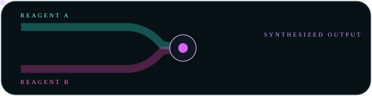

# 🐰🧪⚡ RABBIT CHAMBER 10 // CAUSALITY LEARNS TO SWIM

> Five files. Five cells. One imaginary continuous machine.

This chamber attacks the previous breeding list directly: **phase-offset serial organs**, bubbling ampoules, and actual liquid logic. The central experiment is whether time can bridge geometry GitHub refuses to let us bridge.

---

## 01 // FIVE-ROW HYDRAULIC / PHOTON SPINAL CORD

<table>
<tr><th>organ</th><th>stage</th><th>native report</th></tr>
<tr><td></td><td><b>01 / INTAKE</b></td><td>packet enters the upper chamber</td></tr>
<tr><td></td><td><b>02 / OPTICS</b></td><td>cyan carrier crosses the first bulkhead</td></tr>
<tr><td></td><td><b>03 / CHROMA</b></td><td>carrier becomes spectrally irresponsible</td></tr>
<tr><td></td><td><b>04 / THERMAL</b></td><td>amber reagent acquires suspicious warmth</td></tr>
<tr><td></td><td><b>05 / OUTPUT</b></td><td>violet packet returns to reality</td></tr>
</table>

Every tube is a **different SVG with the same five-second master cycle**. Their visible windows are phase-offset. The photon should therefore appear to fall through the table one module at a time, while GitHub's borders become literal coupler seams.

This is the continuity trick we wanted: not spatial continuity, but **temporal continuity**.

---

## 02 // BUBBLING AMPOULE BANK 🧪

Four reagents, four independent bubble periods. Because the loops do not share a duration, their relationship drifts instead of producing an obvious synchronized GIF rhythm.

| reagent | channel | interpretation |
|---|---|---|
| cyan | optics | clean carrier fluid |
| magenta | renderer | dangerous creative solvent |
| amber | thermal | warm machine blood |
| violet | ??? | probably shouldn't taste it |

A tiny ampoule could eventually replace an ordinary status dot wherever a project needs more biological/laboratory energy.

---

## 03 // LIQUID LOGIC GATE // TWO THINGS ENTER, PURPLE LEAVES

Two reagent packets approach a physical mixing chamber from separate pipes. A synthesized violet packet exits afterward.

The important part isn't chemistry accuracy; it's **causal animation vocabulary**:

`A arrives + B arrives → mixer reacts → C departs`

That grammar can represent merges, compilation, transforms, API composition, dependency resolution, media processing, or whatever other boring software concept deserves wet laboratory hardware.

---

## 04 // SERIAL BUS AS A REAL PROJECT TABLE

<table>
<tr><th>bus</th><th>component</th><th>state</th><th>notes</th></tr>
<tr><td></td><td><b>source</b></td><td>LIVE</td><td>ordinary Markdown stays ordinary</td></tr>
<tr><td></td><td><b>parser</b></td><td>READY</td><td>row border reads as removable module seam</td></tr>
<tr><td></td><td><b>renderer</b></td><td>RGB</td><td>motion carries identity down the page</td></tr>
<tr><td></td><td><b>release</b></td><td>WARM</td><td>data is apparently coolant now</td></tr>
<tr><td></td><td><b>artifact</b></td><td>OUTPUT</td><td>packet exits without touching the text</td></tr>
</table>

This is much closer to useful README furniture than a single giant decorative SVG. The leftmost column is replaceable hardware; every useful fact remains real text.

---

## 05 // MIXED SIGNAL BENCH

<table>
<tr><td></td><td><b>REAGENTS</b> four asynchronous sources</td></tr>
<tr><td></td><td><b>MIXER</b> causality rendered as plumbing</td></tr>
<tr><td></td><td><b>OBSERVATION</b> fuzzy phosphor tells on the machine</td></tr>
<tr><td></td><td><b>LOAD</b> tiny instrument refuses to sit still</td></tr>
</table>

Liquid + CRT is a particularly good marriage: one is slow, physical and organic; the other is electrical, twitchy and haunted. Metal/glass chassis work keeps them in the same universe.

---

## 06 // BREEDING RULE DISCOVERED

The strongest pieces now have **different temporal personalities**:

- CRT traces crawl quickly and continuously;
- photons travel decisively;
- meters wander;
- liquids slosh slowly;
- bubbles rise irregularly;
- calibration hardware rotates almost imperceptibly.

If everything moves at the same speed, the page becomes a banner ad. If each material obeys its own implied physics, the document feels **alive but not animated**.

> Motion should explain what a material *is*, not merely announce that SVG supports animation.

---

## 07 // NEXT BREEDING TARGETS 😈

Now that the serial illusion works in principle, the next mutations should get stranger *and* more reusable:

- **RX → TX pair across distant sections:** a packet gets swallowed near the top of the README and a matching packet emerges several screens later;
- **hydraulic table nervous system:** left-side tubes with row-specific valve flashes, so activity visibly selects a corresponding native row;
- **liquid level meter:** actual sloshing fluid height maps visually to LOW / NOMINAL / HOT states;
- **condenser/radiator furniture:** glowing coolant enters hot, crosses fins/coils, leaves cyan;
- **droplet splitter:** one packet becomes three differently colored child channels;
- **mechanical iris:** aperture opens when a packet arrives, then closes behind it;
- **tape reel / rotary memory organ:** slow spinning physical storage for release/history sections;
- **animated screenshot lower bezel:** CAPTURE → PROCESS → READY lamps cycle under an untouched native screenshot;
- **tiny wet status atoms:** bubble, meniscus, pressure diaphragm, valve wheel and condensation window;
- **interchangeable motion skins:** identical geometry with `static`, `quiet`, `alive`, and `feral` temporal personalities;
- **reduced-motion twins:** every useful component gets a still sibling rather than making animation mandatory;
- **one full README specimen:** stop testing isolated organs and assemble a believable project page from the furniture library.

### New biological law

`geometry = anatomy`  
`Markdown = memory`  
`color = chemistry`  
`animation = causality`  
`timing = material`  
`GitHub seams = joints`

> The README is no longer wearing a machine costume. **It has acquired organs.** 🩷🐰
