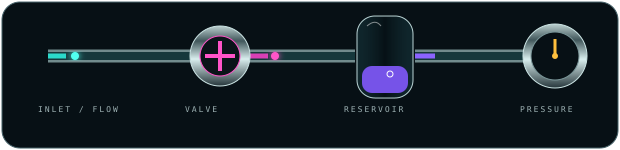
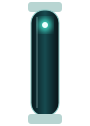
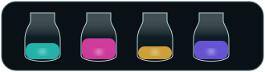

# 🐇🧪 RABBIT CHAMBER 11 // THE MACHINE DEVELOPS CONSEQUENCES

> Motion is no longer ornament. Something happens because something else happened.

The previous chambers discovered temporal continuity, CRT motion, liquid, and signal combination. This generation gives those motions **causal grammar**.

---

## 01 // ONE LITTLE MACHINE, FOUR CONSEQUENCES

The cycle is deliberately readable left-to-right:

**packet arrives → valve turns → reservoir fills → pressure needle reacts → system relaxes**

The pieces are still independent-looking organs, but their timing tells the eye they belong to one mechanism. This is the useful trick: Markdown cannot run our machine, so choreography becomes the wiring harness.

| organ | event | meaning |
|---|---|---|
| inlet | cyan packet travels | work enters |
| valve | rotor turns | permission / transform |
| reservoir | violet level rises | accumulated result |
| gauge | needle climbs | consequence becomes observable |

---

## 02 // LIQUID SHOULD HAVE JOBS

Liquid now gets a vocabulary rather than merely being pretty:

| behavior | software metaphor | physical reading |
|---|---|---|
| fill | queue / buffer / progress | reservoir acquires mass |
| drain | consumption / completion | chamber empties |
| pulse | event / packet | slug travels through pipe |
| mix | merge / compile | two feeds become one |
| bubble | activity / instability | dissolved gas escapes |
| pressure | load / urgency | gauge reacts downstream |

The visual system can therefore explain state without painting over the native text.

---

## 03 // TABLE-SCALE CAUSAL RACK

| organ | subsystem | state | native report |
|---|---|---|---|
|  | INPUT | LIVE | packet enters the machine |
|  | PROCESS | ACTIVE | computation is visibly twitchy |
|  | BUFFER | WET | actual bubbles now escape the reagent |
|  | LOAD | RISING | downstream consequence is measurable |

Borders are not interruptions here. They are **bulkheads**. Padding is service clearance. Each row is a removable instrument bay.

---

## 04 // BREEDING TARGET: HYDRAULIC LOGIC

Next mutation should split the causal machine into small reusable organs with matching geometry:

- inlet and outlet pipe stubs;
- animated quarter-turn valve;
- tiny reservoir with fill/drain states;
- pressure gauge with several response personalities;
- check valve / one-way packet gate;
- Y-junction mixer and splitter;
- bubble trap;
- sight glass with meniscus;
- dripping condenser / return line;
- tiny peristaltic pump, because apparently the README has organs now.

The same geometry should receive **restrained laboratory**, **amber ultraviolet**, and **SINEBOW CRT** skins without changing attachment points.

---

## 05 // MOTION GRAMMAR

`idle → approach → contact → reaction → consequence → recovery`

Different components should occupy different portions of the cycle. The valve must not turn before the packet reaches it. The gauge must not react before the reservoir fills. A bubble should not rise with clockwork regularity.

That last part matters: slight asynchronous motion makes the machine feel inhabited rather than merely looped.

> We have graduated from animated furniture to tiny lies about physics. 💗⚡🧪

---

## 06 // NEXT BREEDING PROGRAM

The next chamber should test **causal chains across table rows**: an inlet pulse on row one, a valve event on row two, liquid displacement on row three, a CRT response on row four, and a physical-looking output event on row five.

If the timing is right, GitHub's immutable row borders stop being an enemy. They become the bulkheads separating stages of a machine whose *state* passes through them.

Also: make a proper bubble trap. The bubbles have earned plumbing.