# 🐇🔬🌈 RABBIT CHAMBER 12 // GLASS LEARNS TO LIE ABOUT LIGHT

> Dry optics generation. No reagent required. The moving substance is light.

We return to the glass-tube family with everything learned since its first appearance: layered surfaces, internal reflections, depth cues, bloom, animation, and temporal grammar. But this time the glass itself does work.

---

## 01 // RGB REFRACTION TUBE

White light enters ordinary-looking laboratory glass, meets a prism organ, and exits as displaced RGB channels.

The useful visual vocabulary here is **chromatic displacement**. A component can communicate that one input has become several related outputs without replacing the surrounding explanation with artwork.

| optical event | software reading | visual consequence |
|---|---|---|
| white beam | unspecialized input | neutral packet |
| refraction | parse / classify / split | trajectory bends |
| RGB separation | channels / dimensions | identity becomes color |
| recombination | merge / output | future mutation target |

---

## 02 // CHROMATIC LENS CELL

A convex glass organ focuses an incoming pulse and introduces deliberate RGB aberration on the far side.

This gives us a lovely new rule: **imperfection can encode transformation**. Perfect optics merely transmit. Questionable surplus optics tell you something happened. 😈

Potential siblings: concave lens, cylindrical lens, magnifier, Fresnel plate, rotating polarizer, beam expander.

---

## 03 // DICHROIC / SPECTRAL WINDOW

The pane changes spectral character slowly while a small photon crosses it. This is less an instrument and more a material primitive: something that can sit over a screenshot, beside a table row, inside a status plate, or become a tiny inspection window.

The important bits are layered:

- dark transmitted interior;
- pale structural edge;
- restrained white reflection;
- moving specular streak;
- slowly shifting coating color;
- luminous packet visible *through* the material.

Glass should look like an interface between environments, not a translucent rectangle.

---

## 04 // GLASS MATERIAL GRAMMAR

| property | restrained setting | criminal setting |
|---|---|---|
| edge | pale cyan / steel | RGB fringe |
| reflection | one narrow white streak | wandering spectral streaks |
| transmission | smoky blue-black | violet / teal dichroic |
| refraction | subtle displacement | obvious RGB separation |
| bloom | tiny | photon misdemeanor |
| surface | clean-ish | scratches / dust / coating weirdness |
| thickness | implied by inner wall | exaggerated double edge |

This is where the old tube improvement becomes a whole material system. The glass needs an **outer boundary, inner boundary, transmitted field, reflected highlight, and refracted event**. Any one of those alone reads as plastic.

---

## 05 // GLASS AS TABLE FURNITURE

| optic | role | native content |
|---|---|---|
|  | TRANSFORM | real Markdown remains next door |
|  | INSPECT | coating communicates channel/state |
|  | SPLIT | one thing becomes several |

The mandatory table borders suddenly make excellent **optical bench rails**. Cells become instrument mounts. Padding becomes the air gap needed so bloom and edge reflections have somewhere to exist.

---

## 06 // NEXT GLASS BREEDING TARGETS

- RGB **recombiner**: three colored paths converge and leave white;
- animated **beam splitter cube**, with one packet becoming reflected + transmitted children;
- **polarizer pair** whose transmitted beam dims as one optic rotates;
- tiny **diffraction grating** producing a spectral fan;
- **frosted glass** where a sharp beam becomes diffuse bloom;
- scratched / imperfect surplus glass with tiny edge chips and RGB ghosts;
- glass CRT faceplate: fuzzy phosphor animation visibly behind thick curved glass;
- magnifying inspection lens that optically enlarges a tiny status glyph;
- glass sidecar tabs whose colored edge refraction inherits the row's semantic channel;
- matching restrained / max-chroma skins with identical geometry;
- eventually: a whole native Markdown table presented as an **optical bench**, with different glass organs mounted per row.

And one particularly delicious experiment: route a white pulse through several physically separate table cells, letting each cell alter its spectrum until the final row receives a completely different color signature.

> We aren't filling the machine with rainbow. We're making the machine misbehave when rainbow passes through it. 🌈✨
