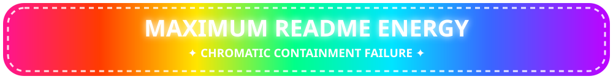

# 🌈 README CHROMATIC VIOLENCE LAB ✨

> A practical specimen sheet for discovering exactly how **unreasonably loud** a GitHub-rendered README can become without custom CSS.

GitHub Markdown keeps arbitrary styling on a short leash, so our weapons are **emoji, Unicode, badges, SVG/image assets, tables, `<picture>`, `<details>`, limited HTML, and animation**. 😈

<p align="center">
  
</p>

# 🩷💜💙 𝕲𝕬𝕽𝕽𝕴𝕾𝕳 𝕳𝕰𝕬𝕯𝕴𝕹𝕲𝕾 💙💜🩷

## ✨ ＦＵＬＬＷＩＤＴＨ ＣＨＡＯＳ ✨
### 🌸 𝓕𝓪𝓷𝓬𝔂 𝓤𝓷𝓲𝓬𝓸𝓭𝓮 𝓒𝓱𝓪𝓸𝓼 🌸
#### ⚡ 𝙄𝙏𝘼𝙇𝙄𝘾 𝙎𝘼𝙉𝙎 𝙈𝘼𝙔𝙃𝙀𝙈 ⚡

> [!CAUTION]
> 🌈 **CHROMATIC CONTAINMENT FAILURE.** Sunglasses are now PPE.

## 🦜 Emoji as Structural Ornament

🌺🌸🩷🌈✨🦜✨🌈🩷🌸🌺  
💖 **WELCOME TO THE BIRD DIMENSION** 💖  
🌺🌸🩷🌈✨🦜✨🌈🩷🌸🌺

| ✨ SYSTEM | 🌈 STATUS | 💥 VIBES |
|:--|:--:|--:|
| 🦜 Bird Engine | 🟢 ONLINE | 💖💖💖💖💖 |
| 🌸 Glitter Reactor | 🟣 CRITICAL | ✨✨✨✨✨ |
| 🔥 Taste Restraint | ⚫ OFFLINE | `0%` |

## 🛡️ Badge Barrage

Badges are one of the easiest ways to inject actual colored rectangles into GitHub Markdown.


```md

```

Try Shields styles such as `flat`, `flat-square`, `plastic`, `for-the-badge`, and `social`.

## 🎨 Actual Color: Images & SVGs

Markdown text itself cannot be arbitrarily colored on GitHub. **Images are the escape hatch.**

```md

```

A repository-owned SVG can carry gradients, neon text, patterns, illustrations, and a truly irresponsible palette.

```svg
<svg xmlns="http://www.w3.org/2000/svg" width="900" height="90">
  <defs>
    <linearGradient id="rainbow" x1="0" x2="1">
      <stop offset="0" stop-color="#ff1493"/>
      <stop offset=".2" stop-color="#ff4500"/>
      <stop offset=".4" stop-color="#ffe600"/>
      <stop offset=".6" stop-color="#00f5a0"/>
      <stop offset=".8" stop-color="#00bfff"/>
      <stop offset="1" stop-color="#b000ff"/>
    </linearGradient>
  </defs>
  <rect width="100%" height="100%" rx="25" fill="url(#rainbow)"/>
</svg>
```

## 🌗 Different Art for Dark & Light GitHub

`<picture>` lets the README mutate with the viewer's theme:

```html
<picture>
  <source media="(prefers-color-scheme: dark)" srcset="./assets/acid-night.svg">
  <source media="(prefers-color-scheme: light)" srcset="./assets/dayglo-catastrophe.svg">
  
</picture>
```

Thus: **two independently obnoxious palettes.**

## 💎 Centered HTML Shrine

```html
<div align="center">

# 🌈✨ ULTRA BIRD ENGINE ✨🌈


**🩷 CYBER • 🧡 GAUDY • 💛 OPEN SOURCE • 💚 UNWISE • 💙 FAST • 💜 BIRD 🩷**

</div>
```

<div align="center">

### ✨ 🦜 ✨

**🩷 PINK · 🧡 ORANGE · 💛 YELLOW · 💚 GREEN · 💙 CYAN · 💜 PURPLE**

</div>

## 📦 Tables as Faux Layout

| 🩷 FEATURE | 💜 DESCRIPTION |
|---|---|
| 🌈 **Chromatic Overdrive** | More hues than responsible interface design permits |
| ✨ **Sparkle Bus** | Transports glitter at unsafe baud rates |
| 🦜 **Bird Core** | Cockatoo-certified nonsense processor |
| 💥 **Retina Assault** | Optional. Allegedly. |

```html
<table>
<tr>
<td></td>
<td></td>
<td></td>
</tr>
</table>
```

## 🌀 Animated GIF Apocalypse

```html
<p align="center">
  
  
  
</p>
```

For authentic 1998-web-page psychic damage: spinning objects, glitter text, flame animations, star fields, tiny looping mascots, aggressively animated dividers. Motion can be inaccessible, though, so deploy the rave responsibly. 💖

## 🪩 Unicode Is Your Unlicensed Typography Department

**Mathematical:** 𝕽𝖆𝖉𝖎𝖔𝖆𝖈𝖙𝖎𝖛𝖊 · 𝓡𝓪𝓲𝓷𝓫𝓸𝔀 · 𝙱𝚒𝚛𝚍  
**Fullwidth:** ＣＨＲＯＭＡＴＩＣ ＶＩＯＬＥＮＣＥ  
**Circled:** Ⓑⓘⓡⓓ Ⓜⓐⓒⓗⓘⓝⓔ  
**Tiny-ish:** ᴛɪɴʏ ʟɪᴛᴛʟᴇ ᴄʜᴀᴏꜱ  
**Decorative:** ꧁༺ 🌈 BIRD ZONE 🌈 ༻꧂

⚠️ Fancy Unicode is **not actually font styling**. It can hurt search, copy/paste behavior, screen-reader output, and character coverage. Keep important project names/instructions available in ordinary text too.

## 🧨 GitHub Admonitions = Free Colored-ish Callouts

> [!NOTE]
> 💙 Behold: information, but theatrical.

> [!TIP]
> 💚 Put useful instructions inside the visual nonsense so nobody can accuse us of having *only* visual nonsense.

> [!IMPORTANT]
> 💜 THE BIRD REQUIRES DEPENDENCIES.

> [!WARNING]
> 💛 Production may contain glitter.

> [!CAUTION]
> ❤️ Do not look directly into `README.md`.

## 🫣 Collapsible Surprise Chambers

<details>
<summary>🌈✨ CLICK TO BREACH CHROMATIC CONTAINMENT ✨🌈</summary>

<br>

# 💥 SURPRISE, NERD 💥

🩷🧡💛💚🩵💙💜🩷🧡💛💚🩵💙💜

```text
      .-.
   🌈(•ө•)🌈
      /|\
   ✨ / \ ✨
```

**The README had a secret boss phase.**

</details>

## 🧬 Code Blocks: Borrow Syntax Highlighting

```javascript
const BIRD = "🦜";
const restraint = false;
const palette = ["🩷", "🧡", "💛", "💚", "🩵", "💙", "💜"];

while (!restraint) {
  console.log(`${BIRD} ${palette.join("✨")} ABSOLUTELY TASTELESS`);
}
```

```diff
+ 🌈 MORE GLITTER
+ 🩷 MORE PINK
+ 🦜 MORE BIRD
- restraint
- subtlety
```

# 🌈 The Maximum-Garishness Stack

1. **Theme-aware `<picture>` hero banner**
2. **Animated neon project logo**
3. **A wall of multicolored Shields badges**
4. **Unicode display heading + ordinary-text subtitle**
5. **Emoji ornamental dividers**
6. **Admonition boxes**
7. **Table-based feature cards with tiny artwork**
8. **Syntax-highlighted examples**
9. **Collapsible easter eggs**
10. **Repo-hosted rainbow SVG section separators**
11. **Animated demo GIFs**
12. **A footer banner so loud it can be detected from orbit**

---

## ☢️ Specimen: The Full Assault

<div align="center">

# ꧁༺ 🩷🌈✨ 𝕭𝕴𝕽𝕯 𝕸𝕬𝕮𝕳𝕴𝕹𝕰 ✨🌈🩷 ༻꧂

### ＴＨＥ　ＫＥＹＢＯＡＲＤ　ＴＨＡＴ　ＥＳＣＡＰＥＤ　ＣＯＮＴＡＩＮＭＥＮＴ


🩷 ══ 🧡 ══ 💛 ══ 💚 ══ 🩵 ══ 💙 ══ 💜

**✨ TYPE WEIRDLY • 🦜 TYPE BIRDLY • 🌈 TYPE LIKE CSS CAN'T STOP YOU ✨**

</div>

> [!IMPORTANT]
> 💜 **Normal Markdown is merely the containment vessel.**

| 🌺 | FEATURE | CHAOS |
|:--:|---|:--:|
| 🦜 | Kaomoji Engine `(ﾉ◕ヮ◕)ﾉ*:･ﾟ✧` | ██████████ |
| 🌈 | Fancy Unicode | ██████████ |
| ✨ | Tool Palette | ██████████ |
| 🩷 | Good Taste | ░░░░░░░░░░ |

<details>
<summary>💥 ACTIVATE FORBIDDEN BIRD TECHNOLOGY</summary>

```diff
+ (づ｡◕‿‿◕｡)づ  ✨🌈✨
+ 𝕮𝖍𝖗𝖔𝖒𝖆𝖙𝖎𝖈 𝕺𝖛𝖊𝖗𝖉𝖗𝖎𝖛𝖊
+ ＧＡＲＩＳＨＮＥＳＳ：１００％
- tasteful restraint
```

</details>

<div align="center">

🩷🧡💛💚🩵💙💜 **END TRANSMISSION** 💜💙🩵💚💛🧡🩷

</div>

## 🧪 Things GitHub Won't Really Let You Do

Don't plan around arbitrary inline CSS:

```html
<span style="color: hotpink; font-size: 72px;">CHAOS</span>
<style>body { background: rainbow; }</style>
<script>alert("🦜")</script>
```

You also don't get to replace GitHub's page background, globally choose fonts, or run arbitrary JavaScript.

> `GitHub Markdown + permitted HTML + Unicode + emoji + badges + SVG/GIF/PNG = 🌈 weaponized Lisa Frank terminal energy 🌈`

### 🦜 Final Principle

Accessibility and garishness are not mortal enemies. Give images alt text, preserve ordinary-text versions of important words, don't communicate status by color alone, respect motion sensitivity, and keep the actual instructions legible.

Then make **everything surrounding those instructions look like a cybernetic cockatoo crashed through a rave supply store.** ✨
