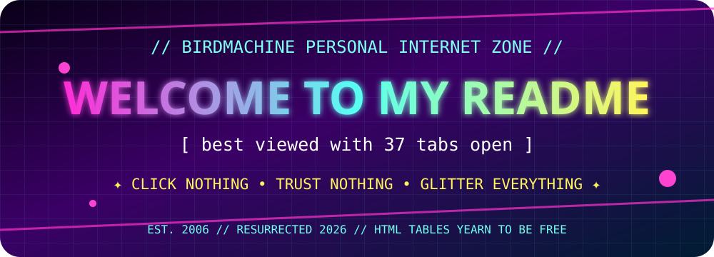
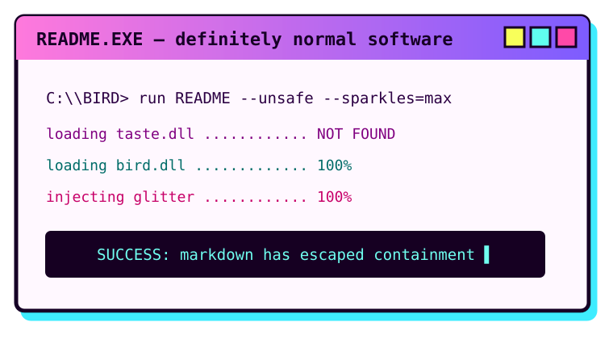
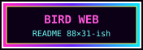
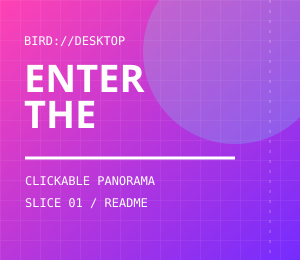
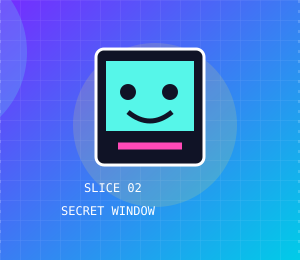
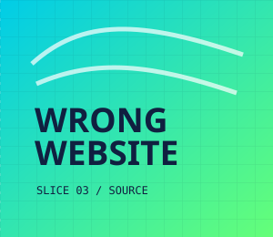
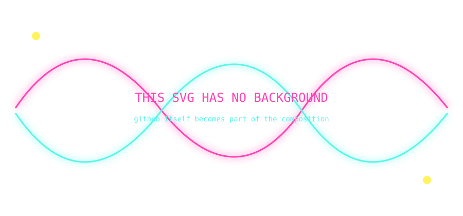

# 🦜 README SHENANIGANS LAB

<p align="center"></p>

> This page is a specimen jar for **image-map-era instincts applied to GitHub Markdown**. Some tricks are robust. Some are goblin engineering. That is the point.

## 01 — The README Is The Image

Stop asking Markdown to lay things out. Make a giant SVG *be* the layout.

<p align="center"></p>

SVG gives us typography, gradients, fake chrome, overlapping objects, arbitrary positioning, scanlines, diagrams, fake interfaces, ornamental borders, etc. GitHub only has to place one rectangle.

---

## 02 — Fake 2004 Microbutton Shrine

<p align="center">
<a href="#03--table-layout-is-not-dead-it-was-merely-sleeping"></a>
<a href="./README.md"></a>
<a href="#06--collapsible-secret-level"></a>
<a href="./assets/myspace-terminal.svg"></a>
</p>

Same asset, intentionally inconsistent widths. Instant janky-web mosaic. Each image can independently be a link, so ornamental graphics can secretly be navigation.

---

## 03 — Table Layout Is Not Dead, It Was Merely Sleeping

<table><tr>
<td width="38%" align="center"><br><b>LEFT SHRINE</b><br><sub>tiny little web artifact</sub></td>
<td width="62%"><br><code>&lt;td&gt;</code> has entered its second life.</td>
</tr></table>

Nested-ish visual composition via HTML tables is extremely MySpace. GitHub controls plenty of the styling, but images do the visual heavy lifting.

---

## 04 — Fake UI Controls That Are Actually Links

<a href="./README.md"></a>
<a href="./assets/fake-window.svg"></a>
<a href="#top"></a>

Buttons aren't buttons. Windows aren't windows. The README is a stage set. 😌

---

## 05 — Theme-Sensitive Parallel Universes

<picture>
  <source media="(prefers-color-scheme: dark)" srcset="./assets/myspace-terminal.svg">
  <source media="(prefers-color-scheme: light)" srcset="./assets/fake-window.svg">
  
</picture>

Same coordinate, two entire compositions. Dark/light mode can be an alternate universe instead of a palette change.

---

## 06 — Collapsible Secret Level

<details>
<summary><b>🗝️ OPEN THE SUSPICIOUS DOOR</b></summary>

<br>
<p align="center"></p>

<table><tr><td>

### YOU FOUND THE UNDER-README

`README.md` can have optional rooms: huge art, lore, debug info, joke endings, alternate interfaces.

</td><td align="center"><br><b>+37 BIRD</b></td></tr></table>
</details>

---

## 07 — Faux Full-Bleed / Cropped Panorama

<p align="center"></p>

The container still wins, but deliberately absurd dimensions probe desktop/mobile scaling and occasionally create wonderfully cursed edge cases.

---

## 08 — README Dollhouse

<table>
<tr><td colspan="3" align="center"></td></tr>
<tr><td align="center"><br>ATTIC</td><td rowspan="2" align="center"><br><b>MAIN CHAMBER</b></td><td align="center"><br>TURRET</td></tr>
<tr><td align="center">🦜<br><sub>bird room</sub></td><td align="center">✨<br><sub>forbidden glitter</sub></td></tr>
</table>

A README doesn't need to look like a document. It can look like a little illustrated object with Markdown hiding between the floorboards.

---

## 09 — Invisible Structure / Visible Art

<!--
THIS COMMENT IS PART OF THE PIECE.
SOURCE-VIEW EXPLORERS GET A SECOND LAYER.

         .-.
        (o o)  YOU LOOKED BEHIND THE WALL
        | O \
         \   \
          `~~~'

THE RENDERED PAGE IS ONLY THE FRONT OF THE BUILDING.
-->

The rendered view is the glossy facade; comments make raw source a second easter-egg surface. **Two audiences, one file.**

---

## 10 — IMAGE MAP BY DISMEMBERMENT 🩷🔪

Here it is. One apparent 900×260 composition, physically chopped into three SVGs. Every third of the artwork is independently clickable.

<table cellspacing="0" cellpadding="0"><tr>
<td width="33%" valign="top"><a href="./README.md"></a></td>
<td width="33%" valign="top"><a href="./assets/fake-window.svg"></a></td>
<td width="33%" valign="top"><a href="https://github.com/BirdMachine/Scratch/blob/main/SHENANIGANS.md?plain=1"></a></td>
</tr></table>

**The visual object and the hyperlink object no longer have to be the same object.** This is basically the old image-map philosophy reconstructed out of README-safe Lego bricks.

A much nastier version could have 10–20 slices: invisible hit-zones masquerading as desktop icons, character faces, windows, doors, stars, etc.

---

## 11 — Deliberately Broken Reality

| NORMAL | WRONG | WORSE |
|:--:|:--:|:--:|
|  |  |  |
| one asset | same asset | still same asset |

Repeated assets at incompatible scales feel like browser corruption without requiring scripting. Mix with giant transparent margins, fake clipping, duplicated UI, and misregistered layers.

---

## 12 — Let GitHub Paint Part Of The SVG

This SVG deliberately has **no background**:

<p align="center"></p>

The GitHub page color shows *through* the art. Instead of merely adapting to the host page, the host page becomes one of our pigments. On different themes, the same asset becomes a different composition without `<picture>`.

---

## 13 — Fake Nested Operating System

<table><tr><td width="160" align="center">
<br>
<br>
<br>
<sub>DESKTOP ICONS??</sub>
</td><td>


</td></tr></table>

A future version can turn every fake icon into a link and every fake application window into another README/anchor. At that point the documentation has become a tiny hypertext operating system wearing GitHub as a trenchcoat.

---

## 14 — Choose Your Own README

<details>
<summary>🚪 <b>DOOR A — touch the ominous pink rectangle</b></summary>

### You have selected poor judgment.

<a href="#10--image-map-by-dismemberment-"></a>

<details><summary>go deeper</summary>

<details><summary>deeper.</summary>

<details><summary>surely this is enough</summary>

**NO.** 🦜

</details></details></details>
</details>

<details>
<summary>🕳️ <b>DOOR B — descend into README basement</b></summary>

```text
/github
   /README
      /README
         /README
            /bird
               YOU ARE HERE
```

</details>

---

## 15 — Current Mutation Queue

- 10–20 slice faux desktop with clickable illustrated hotspots
- fake browser scrollbar / fake GitHub UI bleeding into README content
- spritesheet-ish SVG fragments via coordinated `viewBox` assets
- magazine typography where documentation itself is SVG illustration
- clickable desktop icons leading to anchors / other `.md` rooms
- optical illusions using transparent pixels + GitHub theme backgrounds
- enormous transparent padding to manufacture impossible whitespace
- crunchy raster/SVG mismatch for authentic personal-site compositing
- README labyrinth: several `.md` pages pretending to be rooms/screens
- test whether zero-gap table slicing remains seamless on GitHub mobile

<p align="center"></p>
<p align="center"><b>THE WEB WAS NEVER SUPPOSED TO BECOME THIS TIDY.</b><br><sub>we can put a little 2006 back in it. as a treat.</sub></p>
