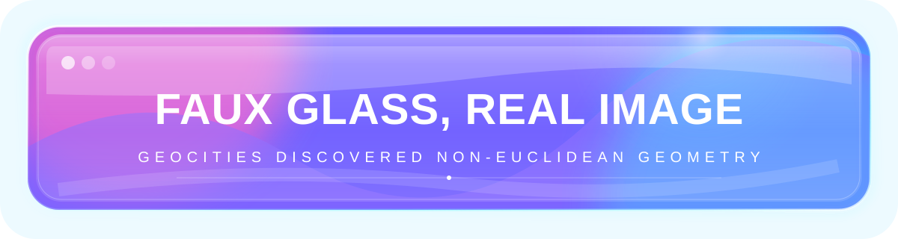

# 🧪 SVG / IMAGE TOMFOOLERY LAB

> **Question:** how much of a bespoke mini-site can we smuggle through GitHub's intentionally boring Markdown renderer if we stop asking Markdown to draw the interface?
>
> **Working thesis:** quite a lot. Markdown becomes the semantic skeleton. Images become the presentation layer. Welcome back to 2007, except the sliced Photoshop comp is now an SVG. 😈

<p align="center">
  
</p>

## 1. The Big Cheat: Pre-render the CSS

GitHub doesn't need to support `box-shadow`, gradients, blur, custom fonts, fancy borders, or glassmorphism **in Markdown** if those effects live inside an image.

The panel above is one SVG containing:

- multiple gradients
- fake reflective glass
- rounded corners
- glow + drop shadows via SVG filters
- display typography
- precise pixel-level composition

The README only says: **put this rectangular thing here**.

This gives us a very funny architectural split:

```text
Markdown / allowed HTML = layout, semantics, links, disclosure widgets
SVG / PNG / GIF         = arbitrary-looking visual chrome
```

## 2. Motion Probe: Can the Pixels Wiggle?

<p align="center">
  
</p>

That border uses SVG `<animate>` / SMIL to move its dash pattern. If it moves in GitHub's rendered Markdown: **excellent, we have repo-native vector animation.** If GitHub freezes or transforms it, animated GIF/APNG becomes the caveman-compatible fallback.

Either way, the core Web-1.5 law holds: **animation inside an image does not require JavaScript in the page.**

## 3. Faux Components Can Be Clickable

The SVG itself does not need to own interaction. Wrap the rendered image in an ordinary Markdown/HTML link:

```html
<a href="https://github.com/BirdMachine/Scratch">
  
</a>
```

<a href="https://github.com/BirdMachine/Scratch">
  
</a>

So we can make things that **look** like glossy buttons, tabs, cards, control panels, CRT screens, Windows Vista widgets, vending-machine controls, etc., while GitHub only sees a linked image.

## 4. 2007 Image Slicing: The Ancient Spell

You remembered correctly: we can attempt the old image-table maneuver.

<table>
<tr>
<td></td>
<td><b>REAL MARKDOWN CONTENT LIVES HERE</b><br><br>The interesting hybrid is using art only for the decorative edges while leaving useful text as actual selectable Markdown/HTML.</td>
</tr>
</table>

### What we're testing

GitHub owns the table CSS. If its cell padding, borders, baseline alignment, or responsive behavior leaves visible seams, **true Photoshop-style pixel slicing is unreliable**.

But the idea evolves cleanly:

- use one SVG for a complete visual card when exact geometry matters;
- use decorative SVG strips above/below normal Markdown content;
- use a table only when a little spacing is acceptable;
- fake a card's *top* and *bottom* chrome with separate images while the middle remains native Markdown.

That last one is basically a 2007 three-slice panel adapted to a hostile stylesheet. 😂

## 5. Full-Width Section Skins

A README section can effectively become:

```text
[ giant illustrated SVG title/header ]
[ normal Markdown text / code / links ]
[ giant illustrated SVG footer/divider ]
```

Because the visual boundary is carried by the images, the Markdown in between *reads* as being inside the same designed component even though technically it isn't.

We can exploit visual continuity: matching background colors, edge highlights, pipes, cables, vines, bubbles, chrome rails, etc. The human eye joins the pieces for us.

## 6. Theme-Aware Alternate Universes

GitHub supports ordinary HTML `<picture>` markup, so one visual can have separate dark/light artwork:

```html
<picture>
  <source media="(prefers-color-scheme: dark)" srcset="./assets/night.svg">
  <source media="(prefers-color-scheme: light)" srcset="./assets/day.svg">
  
</picture>
```

This means a README can have **two independently art-directed skins**, rather than merely hoping one transparent image survives both themes.

## 7. Images as Typography

If text is decorative rather than essential, SVG lets us turn words into composition:

- outlined / extruded lettering
- gradients clipped into text
- neon glow
- curved text paths
- labels embedded in fake hardware
- gigantic title treatments
- pixel-art lettering
- chrome/Y2K/Vista/Web-2.0 typography

For robust rendering across machines, important display text can even be converted to SVG paths offline. Then the viewer doesn't need the font at all.

**Accessibility rule:** repeat essential wording in actual text or a useful `alt` value. The pretty pixels should not be the sole copy of instructions.

## 8. Fake Windows, Devices, Dashboards, Whatever

Nothing stops one SVG from being a screenshot-sized fictional UI:

```text
╭────────────────────────────────────────────╮
│ ◉ ◉ ◉   KEYWI CONTROL DECK               │
├────────────────────────────────────────────┤
│  glossy tabs / meters / glass / bubbles   │
│  tiny mascots / status lamps / chrome     │
│  visual labels / fake controls            │
╰────────────────────────────────────────────╯
```

Then put **real GitHub links immediately below it** or wrap the entire panel in one link.

This gives us something remarkably close to a custom landing page without ever styling GitHub itself.

## 9. Animated GIFs Are Still Ridiculously Powerful

If SVG animation is restricted, GIF remains the cockroach of web technology.

Useful tiny loops:

- shimmer sweeps across chrome headers
- water caustics
- bubbling aquarium strips
- blinking LEDs
- spinning status ornaments
- sparkle passes
- animated mascots
- fake oscilloscope traces
- CRT scan effects
- old-school flaming separators, obviously

A handful of *small*, deliberately-looped GIFs tucked into otherwise static graphics can make a page feel alive without turning the whole README into visual tinnitus.

## 10. The Nasty Hybrid: SVG Background + Native Markdown Foreground

We cannot assign an SVG as a CSS background to arbitrary README HTML. But we can fake the perception of one.

For example:

```text
[ SVG: top of elaborate glass console with title ]

### Native Markdown Heading
real copy, links, badges, checkboxes, code, tables

[ SVG: bottom of same glass console ]
```

If both images visually imply side rails continuing off their edges, the whitespace between them becomes the imagined interior of the console.

**The brain supplies the missing CSS.** This is exactly the delicious sort of crime ancient web design prepared us for.

## 11. Things Worth Probing Next

| Probe | Why it matters |
|---|---|
| SVG `<animate>` | native vector motion without GIF |
| CSS animation inside SVG `<style>` | potentially richer animation |
| SVG filters | blur, glow, shadows, displacement |
| `foreignObject` inside SVG | would allow embedded HTML-like composition if preserved |
| inline SVG vs `` | GitHub sanitizes these differently |
| PNG/APNG | fallback where SVG behavior differs |
| transparent edge strips | faux cards around native text |
| image dimensions + responsive scaling | determines how convincing fake UI panels can be |
| linked image maps / nested links | likely restricted, but worth experimentally verifying |
| `<picture>` theme switching | separate light/dark art direction |
| GIF + static SVG compositing via table | tiny animated subcomponents inside larger faux layout |

## 12. THEORETICAL MAXIMUM

The practical ceiling is not "a colorful README."

The practical ceiling is closer to:

> **a bespoke illustrated microsite whose semantic content is GitHub Markdown, whose layout is nudged by permitted HTML, and whose entire visual design system has been flattened into responsive SVG/PNG/GIF components.**

We cannot truly replace GitHub's CSS, run arbitrary JS, or make arbitrary interactive widgets. But visually? We can cheat **absurdly** hard.

The funniest path may be to deliberately resurrect the design grammar that created these hacks in the first place:

**Aqua + Vista + Web 2.0 + Frutiger Aero + image slicing + tiny animated GIF machinery — built in 2026 because GitHub won't give us CSS.** 🌈🫧🖥️✨

---

### Next specimen I'd build

A complete fake application window in SVG with a glossy titlebar and ornamental side rails, then sandwich **real selectable README content** between matching top/bottom skins. If the illusion holds at desktop + mobile widths, we've basically invented **README skinning by visual ventriloquism**.
