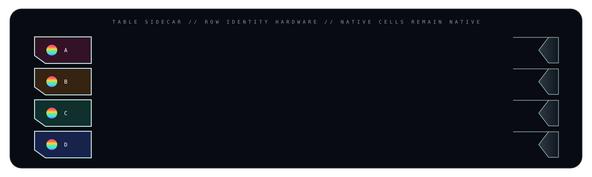
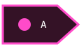
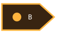
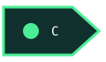
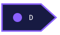
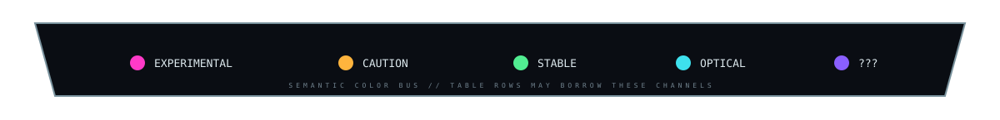
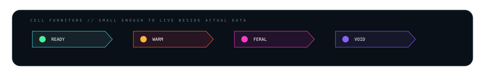
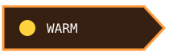
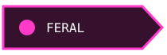
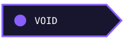

# 🌈📊 TABLE LAB // DATA ACQUIRES EXTERNAL ORGANS

> The table stays a table. Color and shape grow beside it.

The useful constraint: GitHub sanitizes old-school HTML image maps, CSS, and many clever positioning tricks. So rather than fight the host, this lab steals the *visual grammar* of image maps: narrow image cells, linked SVG regions, semantic color keys, and hardware that appears to plug into native Markdown data.

---

## 01 // ROW SIDECARS

The dream is a colored/shaped identity rail running beside boring selectable data. The README-safe implementation is even better than one giant image map: each row can own a tiny image cell.

<table>
<tr><th></th><th>component</th><th>state</th><th>notes</th></tr>
<tr><td></td><td><b>Renderer</b></td><td>READY</td><td>GitHub-native content remains selectable</td></tr>
<tr><td></td><td><b>Optics</b></td><td>WARM</td><td>amber channel / inspect before touching</td></tr>
<tr><td></td><td><b>Photon bus</b></td><td>STABLE</td><td>cyan-green continuity channel</td></tr>
<tr><td></td><td><b>Unknown organ</b></td><td>???</td><td>it was not in the schematic yesterday</td></tr>
</table>

The first column is not data. It is **row furniture**.

---

## 02 // SEMANTIC COLOR BUS

Now color can carry a repeated meaning across tables, callouts, screenshots and section hardware without coloring the actual Markdown.

| channel | meaning | appropriate abuse |
|---|---|---|
| magenta | experimental | prototypes / dangerous fun |
| amber | caution | migrations / caveats / warm hardware |
| green | stable | tested / connected / healthy |
| cyan | optical | links / IO / continuity |
| violet | unknown | mystery meat / future work |

---

## 03 // CELL-SCALE FURNITURE

Instead of decorating the whole table, we can manufacture tiny status objects and put them *inside individual cells*.

<table>
<tr><th>system</th><th>instrument state</th><th>reading</th></tr>
<tr><td>build</td><td></td><td><code>passing</code></td></tr>
<tr><td>thermal</td><td></td><td>62 °C</td></tr>
<tr><td>experimental renderer</td><td></td><td>beautifully inadvisable</td></tr>
<tr><td>unknown subsystem</td><td></td><td>do not make eye contact</td></tr>
</table>

This gets very Winamp: the table becomes an instrument panel while still behaving like HTML data.

---

## 04 // FAUX IMAGE MAP / REAL LINKS

The ancient-web instinct is correct even if `<map>` itself is unreliable here. We can make the *table* act as the map.

<table><tr>
<td></td>
<td></td>
<td></td>
<td></td>
</tr></table>

Each physical-looking region is independently clickable because each is a separate linked image. Same spirit as a 1998 image map; vastly less cursed under GitHub sanitation.

### A // RENDERER
Native anchor target.

### B // OPTICS
Native anchor target.

### C // PHOTON BUS
Native anchor target.

### D // UNKNOWN ORGAN
Native anchor target. It hums.

---

## 05 // NEXT MUTATIONS

This deserves an actual family, because there are several different jobs hiding in the idea:

- **row fins** — tiny colored wedges that identify rows;
- **group brackets** — one tall visual brace spanning the *idea* of several rows;
- **status capsules** — small inline hardware inside cells;
- **table crowns / feet** — establish the table as one physical module;
- **connector stubs** — a colored line appears to enter a row from outside;
- **heat bars / meters** — tiny visual readings beside numeric values;
- **icon sockets** — little bolted housings for project/platform icons;
- **linked row selectors** — fake hardware controls that jump to detailed sections;
- **alternating material strips** — not zebra-striping the HTML, but attaching alternating enamel/glass tabs to its edge;
- **side legends** — a narrow vertical palette that makes color semantic instead of merely pretty.

The fun part is that tables give us something the free-floating furniture did not have: **a rigid native grid to parasitize.** 😈
