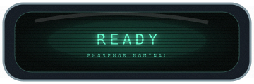
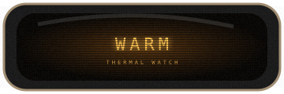
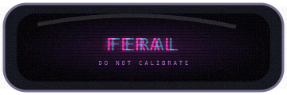
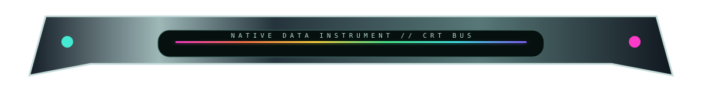

# 🐰📊 TABLE MUTATIONS 02 // THE GRID GROWS ORGANS

> Native GitHub tables are not styling limitations. They are standardized mounting holes.

This chamber pushes the successful architecture from `TABLE-LAB.md`: **tiny furniture owns only the narrow cells it needs; real content remains native beside it.** No giant SVG pretending to contain data.

---

## 01 // LEGO SIDE RAIL — ONE ORGAN, FOUR ROWS

The rail is physically four unrelated SVGs. Matching seams persuade the eye that one continuous glass instrument is bolted to the table.

<table>
<tr><th width="72">BUS</th><th>subsystem</th><th>reading</th><th>interpretation</th></tr>
<tr><td></td><td><b>phosphor core</b></td><td><code>READY</code></td><td>fuzzy green CRT heartbeat detected</td></tr>
<tr><td></td><td><b>scan bus</b></td><td>15.734 kHz</td><td>ancient television wisdom</td></tr>
<tr><td></td><td><b>chromatic coupler</b></td><td>RGB</td><td>three photons in a trenchcoat</td></tr>
<tr><td></td><td><b>host substrate</b></td><td>GitHub</td><td>native content remains selectable</td></tr>
</table>

The useful mutation is **top / middle / middle / bottom anatomy**. Any number of middle segments can be repeated. Different families can share the same dimensions.

---

## 02 // FUZZY CRT STATUS CELLS ARE BACK 📺💚

The CRT should not be clean. Clean CRT is an LCD committing identity fraud.

<table>
<tr><th>instrument</th><th>screen</th><th>native report</th></tr>
<tr><td>renderer</td><td></td><td>nominal; bloom slightly excessive</td></tr>
<tr><td>build system</td><td></td><td>working, but making that smell</td></tr>
<tr><td>experimental organ</td><td></td><td>has discovered opinions</td></tr>
</table>

These screens use layered glow, scanlines, vignette, glass reflection, chromatic edge ghosts and noise. The fuzz is a feature.

---

## 03 // TABLE CROWN + NATIVE BODY + FOOT

| channel | state | notes |
|---|---|---|
| INPUT | `LIVE` | ordinary Markdown |
| CORE | `READY` | selectable text |
| OPTICS | `RGB` | furniture remains decorative |
| OUTPUT | `???` | probably fine |

Nothing encloses the table. The crown and foot merely imply a chassis around it. **GitHub supplies the middle of the machine.**

---

## 04 // ROW CARTRIDGES — COLOR BESIDE CONTENT

<table>
<tr><td></td><td><b>Sinebow bus</b> Full-spectrum identity without touching the content background.</td><td><code>ONLINE</code></td></tr>
<tr><td></td><td><b>Amber ultraviolet</b> Warm smoked-glass warning channel.</td><td><code>WATCH</code></td></tr>
<tr><td></td><td><b>Citrus bio-lab</b> Emerald / chartreuse / orange instrumentation.</td><td><code>STABLE</code></td></tr>
<tr><td></td><td><b>Cobalt vermillion</b> Hard industrial blue with hot signal red.</td><td><code>LOUD</code></td></tr>
</table>

This is the architecture I want for real project comparison tables: color/shape is metadata living *beside* the information rather than painted behind it.

---

## 05 // CONNECTOR STUBS — THE DATA HAS WIRES NOW

<table>
<tr><td></td><td><b>API</b></td><td>connected</td><td>the cable appears to enter this datum from elsewhere</td></tr>
<tr><td></td><td><b>renderer</b></td><td>experimental</td><td>hot-magenta optical channel</td></tr>
<tr><td></td><td><b>migration</b></td><td>caution</td><td>do not unplug while reality is mounted</td></tr>
</table>

Later: matching cable *exit* furniture several sections below. Continuity through scroll distance. 😈

---

## 06 // MICRO METERS INSIDE BORING CELLS

| subsystem | load | temperature | weirdness |
|---|---|---|---|
| renderer |  | 41°C | low |
| optics |  | 53°C | beautiful |
| rabbit chamber |  | 88°C | **yes** |

Tiny meters are especially useful because the *number can remain real text*. The image only supplies the instrument metaphor.

---

## 07 // NEXT BREEDING PROGRAM

- tall multi-row brackets with swappable CRT / aero / amber / sinebow skins;
- left **and** right row organs, so content can be physically clamped between metadata;
- table section dividers that look like rack-module separators;
- project-icon sockets with tiny machined bezels;
- miniature fuzzy CRT sparklines and waveform cells;
- glass tubes that visually carry a color channel down several rows;
- row-number hardware suitable for installation steps / changelogs;
- screenshot metadata tables where the screenshot's lower bezel physically plugs into the table below;
- matched table crown + foot + side rail geometry so a native table reads as a complete device;
- a restrained laboratory family and an absolutely irresponsible **SINEBOW CRT ARCADE FAMILY** using identical dimensions.

> We are not skinning the table. We are attaching aftermarket organs to it. 💗
