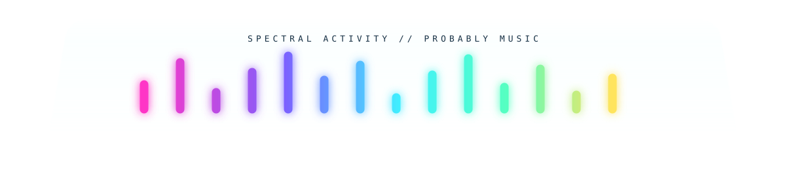
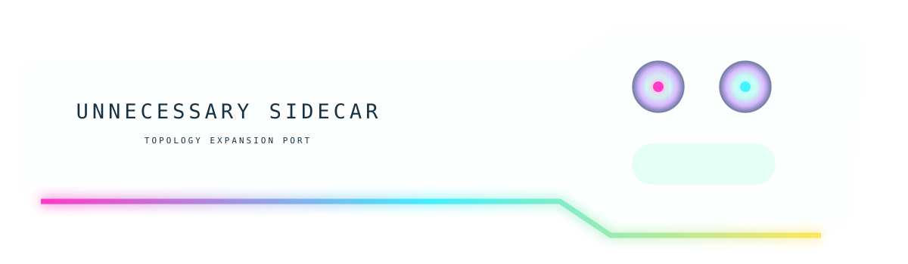

<p align="center"></p>

# 🪩 `TOPOLOGY PARTY // THE CHASSIS HAS STOPPED RESPECTING THE DOCUMENT`

The first terminal proved that disconnected SVG hardware can persuade the eye that native Markdown lives inside a machine. So now the machine is allowed to **change shape while you scroll**.

<p align="center"></p>

## `01 // WINAMP GHOST FREQUENCIES`

That equalizer is not reporting anything. It has no music, no JavaScript, no shame, and fourteen glowing opinions.

Native Markdown continues below it as if a translucent spectral hi-fi component did not just materialize in the document flow.

> `♪ NOW PLAYING: README.md — track 37 of ∞`

<p align="center"></p>

## `02 // THE DOCUMENT SPROUTS AN ORGAN`

<p align="right"></p>

The sidecar is deliberately asymmetric. It makes the apparent chassis widen toward one side even though GitHub's content column has not moved at all.

| PORT | STATE | WHY |
|:--|:--:|:--|
| topology expansion | `OPEN` | apparently necessary |
| opal bus | `GLOWING` | no one stopped it |
| auxiliary reality | `MOUNTED` | read-only-ish |

The trick is no longer merely *frame the content*. The trick is to make separate decorative objects imply that the **physical enclosure around the same linear document has mutated**.

<p align="center"></p>

## `03 // THE MIDDLE OF THE FRAME HAS BEEN DELETED`

<p align="center"></p>

Four pieces of glass imply a rectangle that was never drawn. The giant untouched center is GitHub. Negative space is now doing structural labor.

<details><summary><b>🫧 click the absence</b></summary>

Nothing was hiding behind the frame because there was never a frame.

There were only corners making allegations.

</details>

<p align="center"></p>

## `04 // NECKING EVENT`

<p align="center"></p>

The apparent machine suddenly narrows. GitHub hasn't. We simply changed the width of the optical evidence.

### `small machine thoughts`

```text
width(document)       = constant-ish
width(implied_device) = vibes
```

<p align="center"></p>

## `05 // TINY INTERNAL BUS`

<p align="center"></p>

And then it begins expanding again.

<p align="center"></p>
<p align="center"></p>
<p align="center"></p>

## `06 // FULL-WIDTH REENTRY`

We have effectively drawn a **shape in scroll-space**. No single asset contains that shape. It exists only after your brain remembers the widths of things it saw several hundred pixels ago.

This suggests an especially silly design primitive:

> **scroll topology** — the silhouette of an interface is distributed through time rather than space.

<p align="center"></p>

## `07 // SECOND EQUALIZER, WORSE JUSTIFICATION`

Because Winamp understood something modern software occasionally forgets: if a UI element can glow, bevel, pulse, shimmer, extrude, scroll, sparkle, or resemble stereo equipment, there is at least a philosophical argument that it should.

<table><tr><td width="18%" align="center">◢<br><sub>LEFT THING</sub></td><td width="64%">

### Native content bay

This cell is deliberately boring Markdown again. The surrounding page has spent enough visual capital that plain text starts reading like an intentional display surface.

**The decorations teach the eye how to interpret the undecorated regions.**

</td><td width="18%" align="center">◣<br><sub>RIGHT THING</sub></td></tr></table>

<p align="center"></p>
<p align="center"></p>

<p align="center"><b>THE DEVICE WAS NEVER RECTANGULAR.</b><br><sub>THE DEVICE WAS NEVER ONE DEVICE.</sub><br><sub>THE DEVICE MAY HAVE BEEN A SCROLLING HALLUCINATION CAUSED BY CONSISTENT MATERIAL CUES.</sub></p>

[Materials Lab](./MATERIALS-LAB.md) · [Optical Negative Space](./OPTICAL-NEGATIVE-SPACE.md) · [Disassembled Device](./DISASSEMBLED-DEVICE.md) · [Non-Euclidean GeoCities](./NON-EUCLIDEAN-GEOCITIES.md)
