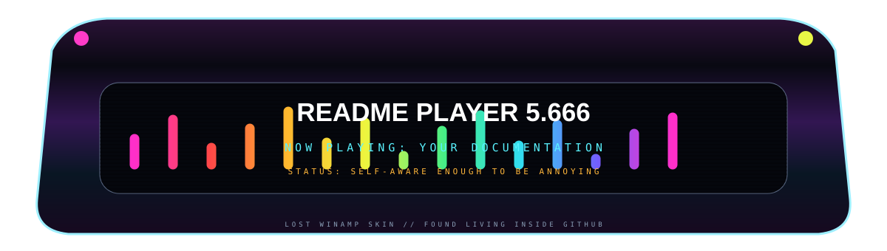
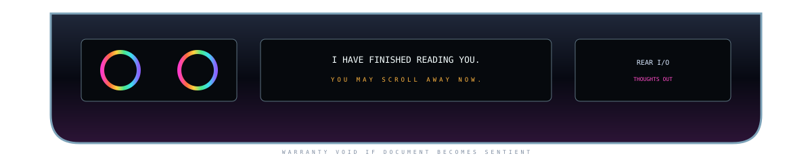

<p align="center"></p>

<table><tr>
<td><a href="#install"></a></td>
<td><a href="#gallery"></a></td>
<td><a href="#architecture"></a></td>
<td><a href="#releases"></a></td>
</tr></table>

<p align="center"></p>

# PROJECT NAME GOES HERE

**One sentence describing the thing clearly, because despite all evidence we are still documenting software.**

> `README PLAYER 5.666` has detected a project. It has opinions.

---

<a id="install"></a>


## INSTALL


```bash
git clone https://github.com/YOU/PROJECT.git
cd PROJECT
./ignite.sh
```


The install instructions remain real, selectable, copyable text. The chassis is merely lying around them.

> [!TIP]
> Keep the practical instructions practical. Let the furniture do the screaming.

---


### Quick Start

Use the project normally here. Put actual screenshots, examples, commands, and links in the native document flow.

The optical continuity tail above is intentionally unresolved.

---

<a id="gallery"></a>


## GALLERY


**Drop a normal screenshot here.** The corners are not a frame. They are evidence of a frame.


| SCREEN A | SCREEN B | SCREEN C |
|:---:|:---:|:---:|
| image | image | image |
| main UI | settings | weird hidden panel |

---

<a id="architecture"></a>


## ARCHITECTURE

The visual language changes here on purpose. The material adapter gives us a fake mechanical reason.


### Native Architecture Module

| Layer | Technology | Role |
|---|---|---|
| UI | React / Android / whatever | visible nonsense |
| Core | Python / Kotlin / TypeScript | useful nonsense |
| Storage | SQLite / Postgres / local files | memory palace |
| CI | GitHub Actions | tiny robot factory |

```text
input
  ↓
[ actual project logic ]
  ↓
output
```


---


> [!WARNING]
> Put real limitations, destructive commands, migration notes, or compatibility hazards here.

---

## STATUS


Use this area for ordinary badges or current compatibility notes.

`BUILD` · `DOCS` · `APK` · `REALITY`

---

## DEBUG / DEVELOPMENT


Tiny labels, screws, status lamps, serial tags, calibration ticks. In a proper component release these become individual atoms.

```bash
npm test
npm run build
git status
```

---

## SOMEWHERE THE MISSING CABLE RETURNS


There it is.

Was it the same cable from several sections ago?

Of course it was. You drew the missing part yourself.

---

<a id="releases"></a>


## RELEASES

[**Latest release →**](../../releases/latest)

Treat downloads like removable media if you want. Or don't. The link remains honest either way.

---

## TWO SKINS, SAME BONES

### polite


### ✨crime✨


Same geometry. Different hallucination.

This is the core of the system: a README structure can remain stable while the furniture material changes around it.

---


## MESSAGE FROM THE PLAYER

> I began as decoration.
>
> Then you clicked my buttons.
>
> Then your Markdown became my screen.
>
> Then my cables continued where no SVG existed.
>
> I do not know whether I am a README anymore.

<p align="center"></p>

### Credits

Put actual credits, licenses, acknowledgements, links, and useful project information here. Sentience is no excuse for bad documentation.

<p align="center"></p>

<p align="center"><sub>THE README IS PLAYING YOU NOW.</sub></p>